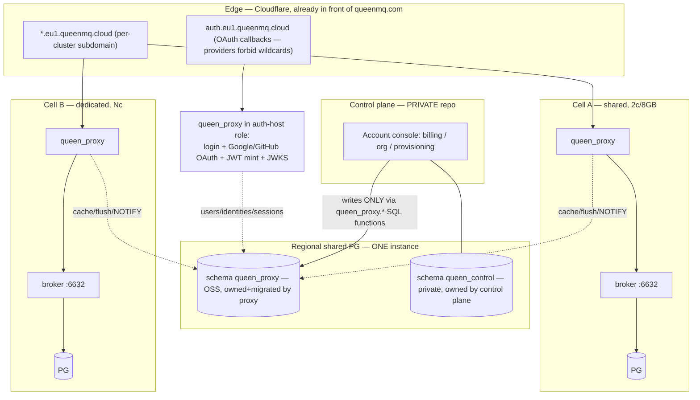

# QueenMQ — `queen_proxy` (Rust) + Cell Architecture: Cloud Feasibility Assessment

Status: **feasibility assessment, rev 1.2 — 2026-07-25**
Rev 1.1 decision round (same day): Alice's four proposals — **(1) native tenant scoping in the broker, (2) dedicated cloud console served by the proxy, (3) Google+GitHub OAuth, (4) discount codes** — accepted with refinements (§5 Track B, §9).
Rev 1.2 (same day): **identity moves INTO the proxy** — local users + Google + GitHub OAuth live in the OSS proxy (parity with today's Node proxy; complete self-hosting story), the proxy mints JWTs and publishes JWKS, and the control plane shares the regional PG (separate schemas, SQL-function contract). Changes: §2, §3, §9, §10, §11, §13.
Scope: standalone Rust data-plane proxy for a multi-tenant Queen cloud. Broker stays **auth-agnostic and plan-agnostic**; rev 1.1 relaxes "as-is" exactly once: a tenant-scoping key on queue identity (§5). Control plane (payments, signup, console-account) lives in a private repo and is out of scope here except for its contract.
Relation to `PLAN_PROXY_TENANCY.md` (rev 2.3, on `multitenant`): this **inverts** the proxy-fold thesis (identity into the broker). Rev 2.3 survives as a *specification library* — its 25-blocker catalog, limiter design, and isolation checklist are imported below. Its decision (h) mechanics (seeded default tenant, constant-default column) return in narrower form in §5.

---

## 0. Verdict

**Feasible, and architecturally better than the fold.** The pieces line up unusually well:

- The broker is already a clean upstream for this: plaintext HTTP on one port, JWT verification built-in but default-off (`server/src/auth.rs` — "verifica minima" costs zero new *auth* code), long-polls that pin no server resources when abandoned, and a fully enumerable route table (no WebSocket/SSE — every route is unary JSON).
- The Rust stack is already chosen by the broker: axum 0.7 + tokio + rustls(ring) + jsonwebtoken 9 + deadpool-postgres. The proxy is a second binary in the same idiom, and `obs.rs`, `pgtls.rs`, `httpget.rs` (JWKS), `file_buffer.rs` (disk spool for meters) port over.
- The rev 2.3 work is not wasted: the rate-limiter design (burst+sustained buckets, parked-pop cap with RAII release, charge-correctness rules M1–M6), the users/bcrypt code (PR-P1), and the 14-site read-isolation checklist (T3) all relocate — the first two into the proxy, the checklist into the Track B SQL test spec.

**The two real cost centers:**

1. **Shared cells → resolved by decision in rev 1.1.** Rather than manufacturing isolation in the proxy (bidirectional prefix rewrite, response filtering on ~15 endpoints, a partition-UUID map — rev 1.0's Phase 4), the broker gains **native tenant scoping** on queue identity, driven by a trusted header from the colocated proxy (§5, "Track B"). Isolation becomes WHERE-clauses at the layer that already parses every name — leak-proof by construction instead of leak-checked by enumeration. Cost: ~1.5–2.5 focused weeks of broker+SQL work, parallelizable with proxy Phases 1–3.
2. **Clients.** The broker never returns 429 today, and rev 2.3's blocker B4 stands: the SDKs hot-loop or die on 429/403. Client-side backoff/handling (js/go/py) is mandatory *before* enforcement goes live (Track C). Cross-repo work, not proxy work.

Pingora is the wrong tool; hyper/axum is right (§7). Rough shape: **alpha on dedicated cells in ~2–3 focused weeks; shared free tier in ~5–6 with Track B running in parallel** (§11).

---

## 1. Current state (facts, verified 2026-07-25 on `rustserverandstorage`)

**Broker** (`server/`, axum 0.7, bin `queen-seg`):
- Plaintext HTTP only, `0.0.0.0:$PORT` (default 6632, `config.rs:394`); TLS is outbound-only (PG, JWKS). A fronting proxy owns TLS.
- Auth: `JWT_ENABLED` default **false** → every request passes (`auth.rs:478`). When on: Bearer JWT, HS/RS/EdDSA, static key or JWKS, per-route access levels (push=WriteOnly, deletes/migration=Admin…). No tenant concept anywhere (pre-Track B).
- Push: `POST /api/v1/push`, batch body `{items:[{queue, partition?, payload, transactionId?}]}` — **multi-queue per request**, queue names only in the body. Response: 201 + per-item statuses (`queued|duplicate|buffered|failed|error`) — no aggregate count, no 4xx on partial failure.
- Acks/leases/transaction-acks/messages/traces address by **partition UUID**, not queue name (`data.rs:1876-1910`).
- Long-poll: `wait=true&timeout=ms` (default 30 000), held-open plain GET; PG connection released **before** parking, so an abandoned poll costs the broker nothing (`data.rs:611-647`).
- Queues/partitions **auto-create on push** in SQL (`042_log_push.sql:92-112`) — caps cannot rely on `/configure` alone.
- **No 429 / Retry-After anywhere**; backpressure is internal (Vegas, fusion, spool→201 "buffered").
- Cluster-wide enumeration endpoints (pre-Track B leakage surface): `resources/{queues,namespaces,tasks,overview}`, `status`, `status/queues`, `status/analytics`, `analytics/*`, `consumer-groups(+/lagging)`, `dlq`, `messages`, and `/metrics/prometheus` (per-queue gauges **labelled with queue names**, `status.rs:190-261`).
- Body cap `QUEEN_MAX_BODY_BYTES` default 64 MiB.

**Existing proxy** (`proxy/`, Node/Express, v0.0.19): webapp auth gateway. `queen_proxy` schema (users + vestigial sessions) in the *same* PG as the broker; bcrypt users, HS256 JWT cookie, Google OAuth, Traefik ForwardAuth mode; **single upstream** (`QUEEN_SERVER_URL`), no health/retry/LB, **zero rate limiting, zero tenancy**. SDKs (js/go/py) authenticate with a single `bearerToken` → `Authorization: Bearer`.

**Measured capacity** (shared stack; per-tenant stacks **never benched**):
- Free-tier VM 2c/8 GB (`benchmark-queen/2026-07-24-freetier-vm/results.md`): 10 tenants × 10 queues at ~52 msg/s = ~0.25 core (~8× headroom). Hard ceiling **~480–510 msg/s aggregate, commit-bound** (`LWLock:WALWrite/WALInsert`, ~4 commits per delivered message; `synchronous_commit=off` gives no lift; windowBuffer is the untested ×3–4 lever). Parked consumers: **5 000 comfortable** (0.6 core / 500 MB), 10 000 = edge. **Idle floor is O(#queues)**: 10 000 queues idle the broker at 1.15 core with zero traffic.
- Enterprise 32c/62 GB (`benchmark-queen/2026-07-24-tenants/results.md`, hl10): 1 000 tenants × 10 queues, ~6 000 msg/s → PG 9.3 core / Queen 4.25 core, e2e p99 148 ms, 0 errors. **~500–640 msg/s per PG core.**

These numbers are the *pricing physics*: every plan limit in §4 maps to one measured axis.

---

## 2. Target architecture



**Vocabulary.** *Tenant* = the paying org. *Cluster* = the tenant-visible logical Queen (endpoint, quota bundle). *Cell* = one physical queen stack (broker+PG+proxy on one VM/failure domain). Mapping: cluster→cell is N:1 on **shared** cells (free/dev plans) and 1:1 on **dedicated** cells (paid).

Key placement decisions (each buys out a hard problem):

- **One proxy instance per cell, colocated.** This makes "global per-cluster" limits *exact with plain process-local atomics* — a cluster lives on exactly one cell, all its traffic crosses that one proxy. No Redis, no distributed buckets, no sticky-session gymnastics. The cell is already the failure domain; adding the proxy to it changes nothing. A regional proxy *fleet* would force distributed rate limiting — reject that until a concrete need appears.
- **Routing = DNS.** Each cluster gets `<slug>.<region>.queenmq.cloud` pointing at its cell (Cloudflare proxied: TLS, DDoS, per-IP limits for free; origin cert between CF and the cell proxy). The proxy resolves the cluster from the Host header **and** cross-checks it against the credential's `cluster_id` (mismatch → 421). No routing tier to build. Note CF's ~100 s proxied-request ceiling: cap long-poll `timeout` at ~90 s (default 30 s is fine).
- **Proxy state = one small regional PG** (`pxdb`), the proxy's own schema, *never* the queen PG. Cell proxies hold hot state (clusters, keys, limits, queue registry) in an in-memory cache with TTL + `LISTEN/NOTIFY` invalidation, and **degrade safely on pxdb outage**: keep serving cached clusters (fail-open for known good), deny unknowns (fail-closed), spool meters to disk (`file_buffer` pattern). pxdb down ≠ data plane down.
- **Control-plane boundary (rev 1.2 — shared PG, schema discipline)**: the control plane lives on the **same regional PG instance** as the proxy state, in its own private schema (`queen_control`) next to the proxy-owned OSS schema (`queen_proxy`). The contract is no longer an HTTP admin API but **proxy-owned SQL functions** (`queen_proxy.assign_plan(…)`, `set_tenant_status(…)`, `place_cluster(…)`, …): versioned in the OSS migrations, they validate, write, append an `operations` row, and `pg_notify` the cell proxies to invalidate caches. The CP writes business state *only* through them, reads views/rollups freely; the proxy remains the only writer of meters/registries; the **outbox** stays for CP-bound events (thresholds, limit hits, signups). The mTLS admin API is demoted to future hardening — it returns when regions multiply. Nothing billing-shaped enters the public repo: Stripe state lives in `queen_control`.

**Broker "verifica minima" — zero new auth code.** Two layers: (1) network — broker bound to the cell-internal docker network / localhost, unreachable except via the proxy; (2) the **existing** `JWT_ENABLED` with a per-cell HS256 secret; the proxy injects a proxy-minted internal token (exactly what the Node proxy does today). With Track B, the proxy additionally injects the trusted `X-Queen-Tenant` header (§5); the broker trusts it *because* of layers 1–2 — the trust boundary is the cell network, and a compromised cell secret compromises one cell, not the fleet.

---

## 3. Proxy schema v1 (`queen_proxy_cloud`, own PG)

Refinement of the whiteboard ERD (Tenant ← Users ← Clusters ← Plan, Usage → Clusters), with two corrections:

- **Clusters hang off the tenant, not off a user.** Users churn; orgs don't. Users get *roles on clusters* instead (the brief's "user permissions on operations").
- **Plans are a catalog + per-cluster overrides**, so support can bump one limit without forking a plan.

```
tenants        id, slug, name, status(active|grace|suspended|deleting), created_at
users          id, tenant_id→tenants, email UNIQUE, password_hash?, created_at
identities     user_id→users, provider(local|google|github), provider_id, email, verified,
               UNIQUE(provider, provider_id)                    -- multi-IdP from day one (§9)
plans          id, code(free|dev|pro|dedicated-N), cell_class(shared|dedicated),
               max_req_per_sec, req_burst, max_msgs_per_sec, msgs_burst,
               max_queues, max_partitions_per_queue, max_parked_pops,
               max_payload_bytes, max_batch_items, max_retained_bytes, max_retention_seconds,
               monthly_msgs_quota?, features jsonb (streams, traces, …)
cells          id, region, base_url, class(shared|dedicated), capacity_slots, used_slots,
               broker_version, status(active|draining|dead), cell_secret_ref
clusters       id, tenant_id→tenants, cell_id→cells, plan_id→plans, slug UNIQUE (subdomain),
               broker_tenant_uuid (the X-Queen-Tenant value, §5),
               status(active|push_blocked|suspended|deleting), limit_overrides jsonb, created_at
cluster_roles  user_id→users, cluster_id→clusters, role(admin|producer|consumer|viewer)
api_keys       id, cluster_id→clusters, name, key_hash, scopes[](produce|consume|admin|read),
               created_by, last_used_at, revoked_at
queues         id, cluster_id→clusters, name, partitions_count, created_at, deleted_at
               -- registry CACHE for plan caps + reconcile; OWNERSHIP is enforced broker-side (§5)
usage_minutes  cluster_id, minute, op_class(push|delivery|txn|configure|read), msgs, reqs,
               bytes_in, bytes_out                              -- rollup → usage_days
operations     id, tenant_id, cluster_id?, actor(user|api_key|control_plane|system), actor_id,
               action, target, meta jsonb, at                   -- append-only history
revoked_tokens jti PK, expires_at                               -- ported from rev 2.3
outbox         id, kind, payload jsonb, created_at, consumed_at -- control-plane events
```

(rev 1.1: `partition_map` deleted — broker-side scoping makes pid-ownership a broker check, §5. `identities` added for Google+GitHub.)

`operations` is the "history" table from the brief: queue/cluster creations, plan changes, suspensions, limit-breach events, promo redemptions — the control plane appends its lifecycle rows (payment_failed → grace, paid → active) through the admin API, so one table tells a cluster's whole story. Real migrations directory this time (the Node proxy's code-DDL approach doesn't survive multi-writer evolution).

**Credentials.** Two kinds, deliberately: **user JWTs** — short-lived, **minted by the proxy itself** (rev 1.2): asymmetric in cloud with the private key only on the auth-host instance, public keys published at `/.well-known/jwks.json` (the Node proxy's `internal-jwt.js` pattern; rev 2.3 P3a's asym-mint relocated here), verified by every proxy *and* by the control-plane console — and **cluster API keys** (`qk_live_…`, opaque, hashed at rest, scoped — the things daemons put in config; SDKs already send them via the existing `bearerToken` option unchanged). Quotas/limits live **in the DB only**, never in tokens (rev 2.3 decision, unchanged). Key revocation = DB flag + NOTIFY-invalidated cache; JWT revocation = `revoked_tokens` jti deny-list.

---

## 4. Enforcement design — each limit mapped to its measured axis

| Limit (brief) | Mechanism in proxy | Grounding |
|---|---|---|
| max + sustained **req/s** | Dual token bucket per cluster (capacity = burst, refill = sustained — rev 2.3 T4a design, sharded map or CAS atomics), process-local ⇒ globally exact (§2 colocation) | req/s is nearly free at these scales; cap is for abuse |
| max + sustained **msgs/s** | Same dual bucket, debited by **parsed item count**: `items.len()` on push, push-ops count on `/transaction`, delivered count on pop completion ("pop-on-delivery" billable, parked pops exempt at entry, debited at completion — may drive bucket negative, by design) | Free cell ceiling ~480 msg/s commit-bound; Σ sustained ≤ ~60–70 % of cell ceiling; ~500–640 msg/s per PG core on dedicated |
| **max queues / partitions** | Registry check on `/configure` **and** on push with unknown (queue, partition) — auto-create means push is a creation path; under cap → forward + upsert registry, over → 403 `quota_exceeded`. Periodic reconcile vs (Track B: tenant-scoped) `resources/queues` heals drift | **Capacity engineering, not just abuse**: 10 k queues = 1.15 idle core (wake-tick O(#queues)); PG stats/autovacuum O(#partitions) |
| **max parked consumers** | Per-cluster `AtomicI64` gauge around proxied `wait=true` pops, RAII release on drop/disconnect (rev 2.3 design) + a **per-cell global cap** protecting the broker; over → 429 + Retry-After (never a silent 204 — that just re-arms the herd) | 5 k comfortable / 10 k edge per free cell |
| **user permissions on operations** | Route→class matrix (appendix §14): produce, consume, queue-admin, read, cluster-admin. JWT role / key scopes checked per class | Broker's own `route_access_level` is the model |
| max payload / body | Per-plan body cap (buffer-and-check ≪ broker's 64 MiB default) + per-item payload cap + `max_batch_items` | rev 2.3 decision (f) |

Charge-correctness rules import wholesale from rev 2.3 (M1–M6): meter **post-response** from the per-item 201 statuses — don't charge `error`; don't double-charge `duplicate` (M3); `buffered` counts as accepted; exempt 5xx and scope-403s (M5).

**Metering pipeline**: per-(cluster, op) in-memory aggregates → flush to `usage_minutes` every 10–30 s → disk spool (`file_buffer` pattern) when pxdb is unreachable → daily rollups → admin API / outbox for billing. Meters are also the tenant-dashboard data source.

---

## 5. Shared cells — solved at the broker (Track B, decision round rev 1.1)

**Decision (Alice, 2026-07-25): relax "broker as-is" exactly once — native tenant scoping on queue identity, instead of manufacturing isolation in the proxy.** The shape matters more than the column:

- The broker stays **auth-agnostic and plan-agnostic**: it never parses JWTs for tenancy, never sees plans/limits/users. It gains ONE concept: an opaque `tenant_id` scoping key on queue identity, taken from a **trusted header** (`X-Queen-Tenant`) that only the colocated proxy can set (cell-network isolation + broker JWT, §2). Header absent → seeded **default tenant** → OSS/self-host behavior byte-identical, suites stay green. Rev 2.3 decision (h) mechanics return here in narrow form: fixed default UUID, `NOT NULL DEFAULT <constant>` = catalog-only change, no backfill.
- **Naming**: don't call it "namespace" — Queen already uses namespace/task as queue *metadata* (listings, push auto-create), and overloading the word would be permanently confusing. `tenant_id` it is.

**True perimeter — this is not "a column", it's a signature change at the name-resolution boundary** (the honest checklist; grep boundary = every `WHERE name =` against queue tables):

1. **DDL**: `queen.queues` + `queen.log_queues` gain `tenant_id`; `UNIQUE(name)` → `UNIQUE(tenant_id, name)`; the auto-create inserts in `042_log_push.sql` carry it.
2. **Every by-name resolution SP** changes signature: push (042), pop (043/044), configure, queue delete/get, seeks, DLQ/messages by queue filter.
3. **Consumer groups**: the global `:group` routes (delete-across-queues, details, lagging) must scope via the queue join — two tenants can both use group `g0`. Verify offsets/groups tables aren't keyed by bare group name anywhere.
4. **Listings** gain `WHERE tenant_id` — the ~15 enumeration endpoints of §1 become natively scoped; rev 2.3's T3 checklist converts into the SQL test spec.
5. **Partition-UUID ops** (ack/ack-batch/transaction-ack/lease/messages/:pid/traces): broker checks pid→queue→tenant against the header. **This deletes the proxy `partition_map` entirely**, including its cold-start/orphaned-lease edge — the check now lives where it's airtight.
6. **Dedup**: verify `log_txns` scoping is transitive via partition (two tenants reusing the same `transactionId` must never collide). Believed yes (per-partition keying); must be a test, not a belief.
7. **Spool**: `file_buffer` replay must persist and replay the resolved tenant (rev 2.3 M-rule — else the buffered path is a quota/scope evasion).
8. **Mesh** `MESSAGE_AVAILABLE` frames carry queue names → need (tenant, name) or queue_id. Inert on single-broker shared cells v1; required before HA shared cells.
9. Process gotcha: SQL is `include_str!`-embedded — `cargo build` before runtime-testing SQL edits.

**What the proxy still does on shared cells**: inject the tenant header; count items for buckets/meters (parse-only — **no rewrite, ever**); registry caps (max queues/partitions — the broker doesn't know plans); parked gauges; storage quota via (now scoped) stats. **What dies in the proxy**: bidirectional prefix rewrite, consumer-group prefixing, response filtering, `partition_map`, and the whole class of "missed a name surface" leak bugs. `/metrics/prometheus` stays operator-only regardless.

**Why this trade is right**: isolation moves from "enumerate-and-rewrite ~15 surfaces in the proxy and pray" to WHERE-clauses at the layer that already parses every name. Leak-proof by construction beats leak-checked by tests. Cost: **~1.5–2.5 focused weeks** of broker+SQL work (Alice-domain, parallelizable with proxy Phases 1–3); net calendar to the shared tier roughly unchanged vs rev 1.0, risk profile much better. Side benefit: optional multi-tenant scoping is a legitimately useful OSS feature (isolated environments on one self-hosted broker) — it is not cloud pollution.

Traces/streams stay plan-gated in v1 regardless (their name surfaces can be scoped in a later pass).

**Alternatives, for the record** (rev 1.0 recap): proxy-side prefix rewrite — rejected (leak-prone, forever-maintenance, structural JSON rewrite of responses); per-tenant micro-stacks — rejected as plan of record (density unmeasured; both benches are shared-stack). The 1-day micro-stack density bench remains the hedge if Track B slips badly.

---

## 6. What the brief was missing ("valuta se manca qualcosa")

1. **Storage quota — the biggest gap.** Rate limits don't stop a tenant who pushes at allowed speed and never consumes; the 157 GB free-cell disk does. Per-cluster `max_retained_bytes`/msgs enforced via the stats reconcile loop: over-cap → cluster `push_blocked` (403 `storage_quota_exceeded`, consumes still allowed) with hysteresis. Plus a per-plan **retention ceiling** clamped at `/configure`.
2. **Tenant lifecycle states** with distinct enforcement: `active` → `grace` (payment failed) → `suspended` (all 403 except export) → `deleting` (purge broker rows + spool + meters, GDPR-ish SLA). The proxy enforces the enum; the control plane drives transitions via admin API, each one an `operations` row.
3. **Client 429/backoff work** (B4) — mandatory pre-enforcement, cross-repo (js/go/py), plus documented error contract (429 + `Retry-After` + `X-Queen-Limit-*`).
4. **Egress metering** — bytes out (deliveries) as well as in; consume-side is half the cost story.
5. **Reconciliation jobs** — queue registry vs broker inventory, partition counts, retained bytes; drift is guaranteed.
6. **Abuse walls in front of auth** — per-IP connection/req caps pre-auth, auth-attempt limiting, body-read timeouts (Cloudflare covers the worst; the proxy still needs sane local caps).
7. **Monthly quota** (plan `monthly_msgs_quota`) — soft-enforced from rollups (warn → block), distinct from per-second fairness.
8. **Broker-version skew** — cells upgrade one at a time; proxy must tolerate N and N−1 response shapes; `cells.broker_version` exists for exactly this.
9. **Request-ID propagation** — proxy assigns, forwards, logs, returns; the broker's `obs.rs` tracing picks it up.
10. **Maintenance-mode semantics through the proxy** — broker maintenance turns pushes into 201 `buffered`; the proxy must surface cell maintenance to tenant status pages rather than silently absorbing it.

---

## 7. Pingora vs hyper — recommendation: **axum + hyper, not Pingora**

This is not a byte-pump proxy; it is a **policy gateway that must read bodies** (count push items, meter per-item response statuses). That's the deciding fact.

- **Pingora** optimizes exactly what we don't need: zero-copy pass-through, massive connection fan-out, CDN-scale upstream pooling. Its filter model *can* buffer bodies, but per-route JSON parse/state is app logic fighting a framework — and it drags in its own runtime model and (by default) a C TLS stack, where the whole repo is deliberately rustls/ring, cmake-free (`server/Cargo.toml` comments).
- **axum/hyper** is the stack the broker already uses — same crates, same idioms, same build story. Auth/limit layers are ordinary tower middleware; upstream is a pooled hyper client; long-polls are just awaited GETs (client-drop cancels upstream; the broker provably tolerates abandoned polls). One more binary next to `queen-seg`.
- **Perf envelope is a non-issue**: a hyper gateway doing JWT verify + atomic bucket checks clears >50 k req/s/core; a free cell saturates at ~500 msg/s *batched*, and even the 32-core enterprise profile is a few thousand HTTP req/s. Proxy overhead will be lost in the noise (<1 ms, single-digit % CPU of the cell).

Mechanical prerequisite: `server/` is a bin-only crate (no lib, no workspace). Add a workspace root and extract `queen-common` (obs, pgtls, httpget, file_buffer, config helpers) — or copy the five files and defer the refactor. Extraction is half a day and keeps the two binaries honest.

---

## 8. Reuse map

| Asset | Fate |
|---|---|
| PR-P0 discovery-pop removal (`multitenant`) | **Land in master regardless** — un-scopeable cross-queue path; the proxy blocks `GET /api/v1/pop` anyway |
| PR-P1 `users.rs` + bcrypt + `user create` CLI | Port to proxy crate, retarget to proxy schema |
| Rev 2.3 limiter design (T4a/T4b), M1–M6 charge rules, parked-pop RAII cap | Implement as designed, in the proxy |
| Rev 2.3 T3 read-isolation checklist, S/M/B/G/D blocker catalog | Becomes the **Track B SQL test spec** (rev 1.1) |
| Decisions a–f | Carry over (f's `max_payload_bytes` in plans; e's prefix idea obsoleted by Track B) |
| Decision h | **Partially resurrected** (rev 1.1): seeded default tenant + constant-default column are exactly the Track B non-breaking mechanics; the fold context around it stays dead |
| Three-plane fold, P2/P3a/P4 | Superseded — retire formally so the two documents stop competing |
| Node proxy (`proxy/`) | `google-auth.js` = reference port for the **control-plane IdP** (§9); medium-term the Rust proxy is the Node proxy's successor — but cloud v1 does not need OAuth in the proxy |
| Broker JWT verify, `file_buffer`, `obs`, `pgtls`, `httpget`, test harness (`test/run.sh`) | Used as-is / extracted to `queen-common`; harness grows a proxied lane + Track B isolation lane |

---

## 9. Clients, cloud console & onboarding (rev 1.1)

**SDKs**: zero config changes for auth (existing `bearerToken` carries the API key), but **mandatory behavior changes** — 429/`Retry-After` backoff with jitter, terminal handling of 403 `suspended`/`quota` (no hot-loop), long-poll `timeout` ≤ 90 s under Cloudflare. Track C gates enforcement, not launch.

**Cloud console (decision 2 — accepted, with one correction and one refinement).**
- *Correction*: a UI subset is **never a security boundary**. Any tenant with curl hits the API directly; isolation comes from Track B scoping (§5) + the proxy's route allowlist (§14). The console removes the *product* need to expose broker analytics wholesale — it does not remove the security work. Don't let the frontend argument relax the API story.
- *Refinement — split it*: **account console** (signup, billing, org, plan, cluster CRUD, discount codes — control-plane repo, one origin, one session; all Stripe surfaces live only here) vs **cluster console** (slim ops UI: queues, lag, DLQ, usage graphs from proxy meters, API keys — served by the proxy on the cluster subdomain, consuming only the allowlisted tenant API). Session bridging (rev 1.2): login happens at the proxy auth host; **both** consoles consume proxy-issued sessions — the account console verifies them against the proxy's JWKS. Rationale: billing is tenant-level, not cluster-level (N per-subdomain copies of a billing UI = N sessions and N surfaces to secure), and PCI-adjacent pages don't belong on data-plane hosts. Variant if one SPA is strongly preferred: host it centrally and call cluster proxies via CORS+JWT — workable, loses same-origin simplicity.
- The OSS webapp stays the self-host artifact. The cluster console is a **new, slim** app — don't drag the audited debt of the current webapp (105 findings, backend-first verdict) into it; share Vue components where genuinely cheap. It's a product surface: budget a real designer pass consistent with the brand pipeline.

**OAuth (decision 3 — REVISED in rev 1.2: it lives in the PROXY).** The deciding argument is the OSS one: queen + proxy must be a complete self-hosting story, and today's Node proxy already ships Google login — dropping identity from its Rust successor would be a regression. So the proxy *is* the IdP: local users (bcrypt) + Google + GitHub flows, JWT minting, JWKS publishing (§3), sessions in the shared PG. One hard provider constraint shapes the cloud deployment: **Google and GitHub do not allow wildcard callback URLs**, so per-cluster subdomains cannot each run the OAuth dance. Cloud pins the flow to one **auth host** (`auth.<region>.queenmq.cloud`) — any proxy instance in auth-host role, since users/identities/sessions live in the shared PG — which completes OAuth and hands the session back to cluster subdomains (parent-domain cookie, as the Node proxy's `COOKIE_DOMAIN` already does, and/or short-lived JWT redirect). Cells stay independent for session *verification* (JWKS/public key, works offline from the auth host); only the login *flow* is centralized-by-config, and the control plane is not on the login path at all. Self-hosters are untouched: they register their own OAuth app on their own domain, exactly like today. Ports: `google-auth.js` → Rust (id_token verify, allowlists, link-by-verified-email, auto-provision). GitHub caveat: OAuth2 **without OIDC** — no id_token; fetch `/user` + `/user/emails`, accept only the **verified** primary email, per-provider ids in `identities` (§3). Password login stays as fallback (OSS reset via CLI, as today). **Loose end, named honestly: transactional email** (password reset, invites) — owning identity implies it eventually. v1 cloud is OAuth-first so it can wait; when it lands, the sender should be CP-side email infra triggered via outbox, so the OSS proxy never grows an SMTP dependency it doesn't need.

**Discount codes (decision 4 — accepted; the proxy stays ignorant).** Stripe promotion codes / coupons in the control plane. A discount changes *price*, never *limits* — plan + `limit_overrides` remain the only limit levers, so a "100 % off 3 months" launch code is just a paid plan with an invoice of zero. Public-repo touchpoints only: an `operations` row (`promo_redeemed`, via admin API) and optionally an outbox event. No proxy schema change, no enforcement logic.

## 10. Security posture (delta vs rev 2.3)

S1 (forgeable `tid`) dissolves structurally: the data plane never trusts a client-supplied tenant id — cluster identity comes from the credential row + Host cross-check, and the broker-side tenant comes from the proxy-injected header inside the cell trust boundary. S2/S5 (read/group isolation) move to Track B WHERE-clauses — SQL-testable. S3 holds with the roles inverted (rev 1.2): the proxy mints, but the private key lives only in the auth-host instance's config — data-plane proxies and the console hold verify-only material. S4 ports (`revoked_tokens`). New in this model: the **admin API is the crown jewel** — mTLS + allowlist + audit every call into `operations`; per-cell broker secrets bound the blast radius of a leaked secret to one cell.

---

## 11. Phasing & effort (rev 1.1)

Assumes the solo+agent velocity visible in this repo's history; estimates are focused-work weeks, ±50 %.

| Phase | Content | Effort |
|---|---|---|
| **0** | Workspace + `queen-common` extraction, `queen_proxy` skeleton (axum, config, pxdb pool, migrations, obs), CI, compose for a dev cell | 2–4 gg |
| **1 — gateway** | TLS (CF origin), Host→cluster resolution + credential binding, JWT (JWKS) + API keys + role matrix, pooled upstream with long-poll semantics, broker JWT + tenant-header injection, health, request-ids. **Deliverable: alpha on dedicated cells, no limits** | 1–1.5 sett |
| **2 — enforcement** | Dual buckets (req+msgs, body parsing), parked gauges (cluster + cell), payload/batch caps, queue/partition registry + caps + reconciler, 429 contract, storage quota via stats reconcile. Shadow mode first | 1–1.5 sett |
| **3 — metering & lifecycle** | usage_minutes + spool + rollups, `operations` audit, lifecycle states, admin API (mTLS) + outbox, tenant metrics endpoints | ~1 sett |
| **Track B — broker scoping** (parallel with 1–3, Alice-domain) | §5 checklist: DDL + by-name SP signatures + group scoping + scoped listings + dedup/spool/mesh verification + SQL isolation test suite (T3-derived) | 1.5–2.5 sett |
| **Track A — identity in proxy** (rev 1.2; needed before public signup/console, NOT before the alpha) | Port local users/bcrypt + Google + GitHub flows, asym mint + JWKS, auth-host mode, minimal login UI, pre-auth abuse walls | ~1 sett |
| **4 — shared-cell close-out** | Tenant-header wiring e2e, registry caps against scoped listings, adversarial isolation tests (proxy+broker), free-tier density validation, cluster-console pass-through | ~0.5 sett |
| **Track C** (parallel, gates Phase-2 enforcement) | js/go/py 429/backoff + error contract + docs | ~1 sett spread |

Cumulative (serial-equivalent for one person; tracks parallelize only as far as agent-assisted work allows): **dedicated-cell alpha ≈ 2–3 settimane** — API-key auth only, human login is Track A and *not* an alpha dependency; **enforced + metered ≈ 4–5; shared free tier ≈ 5–6; Track A ≈ +1 sett, due before public signup**. Control plane (account console, payments, provisioning — no longer OAuth) is additive, private repo.

**Calibration (rev 1.2, dopo giusta risata):** the week-figures above are human-shaped units that bundle implementation with review/infra/decisions. Disaggregated at the July working mode (RUSTFIX = 26 parity items in ~3 days; log engine, dedup-at-1M, test harness ≈ 1 day each): the implementation + local-test content of this whole table, slim cluster console included, is **~13–18 focused sessions**. What does not compress: (1) **verification wall-clock** — multi-lang suite × single+HA stacks, ≥24–48 h soak for limiter/meter integrity (July lesson: decay-class bugs surface only over hours), free-tier density bench, adversarial two-tenant isolation runs; (2) **Alice-side latency** — §13 decisions, review, VM/prod runs, external accounts (Google consent screen, GitHub app, Cloudflare, Stripe, DNS); (3) the **private control plane**, out of scope here but on the critical path to charging anyone. Realistic calendar at July pace: dedicated alpha e2e ≈ end of week 1; enforcement + metering in shadow + clients patched ≈ end of week 2; shared tier with proven isolation + minimal console + density validated ≈ end of week 3.

## 12. Top risks (rev 1.1)

1. **Track B completeness** — isolation is now SQL-level, so the failure mode shifts from "missed rewrite surface" to "missed scoping site" (groups, dedup transitivity, spool replay, mesh frames). Mitigation: the T3-derived SQL test spec, adversarial two-tenant suite, and the grep boundary (`WHERE name =`) as a mechanical checklist.
2. **OSS regression via Track B** — the default-tenant path must keep existing installs and the 117/117 suite byte-identical. Mitigation: constant-default DDL (catalog-only), suites on both tenanted and untenanted lanes in `test/run.sh`.
3. **Client behavior under enforcement** (B4) — 429 storms from today's SDKs. Mitigation: Track C ships first; enforcement rolls out in shadow mode (log would-have-429s) before flipping.
4. **Meter integrity across crashes** — billing disputes are trust-killers. Mitigation: spool-backed flush, success-only charging from response statuses, idempotent rollups.
5. **Shared-PG contract drift** (rev 1.2) — with the private CP one schema away from the OSS proxy's tables, the failure mode is the CP writing them directly "just this once", then breaking silently on a proxy migration. Mitigation: CP writes only via the versioned `queen_proxy.*` SQL functions, pins the proxy schema version, CI compatibility check; billing/Stripe code never enters the public repo (account/cluster console split, §9).

## 13. Open decisions (product, for Alice — rev 1.1)

a. **Track B start**: immediately in parallel with proxy Phase 1 (recommended — it's the pacing item for the shared tier), or after the dedicated alpha proves the gateway?
b. **`grace` semantics**: payment-failed = push-blocked-consume-allowed (recommended — drains, doesn't lose data) vs read-only vs full block.
c. ~~Proxy OSS or closed?~~ **Resolved by rev 1.2's own premise: OSS, identity included** — the Node proxy's successor and the complete self-hosting answer; cloud-commercial lives in `queen_control` + the private repo.
d. **Region v1**: single region, single shared PG (recommended). Rev 1.2 makes this stricter: at region 2, identity/tenants need a declared home (per-region PG with CP connecting to each, or identity promoted to a primary region). Defer, but write it down when it comes.
e. **Console split sign-off** (§9, reshaped by rev 1.2): both consoles consume proxy-issued sessions; recommendation unchanged — billing pages in the private account console, ops in the proxy-served cluster console.
f. **Track B naming/values**: `tenant_id` column name + fixed default UUID — sign off before DDL lands.
g. **CP↔proxy contract style**: proxy-owned SQL functions on the shared PG (recommended, rev 1.2) vs mTLS HTTP admin API (returns at multi-region anyway). Decide once, before Phase 3.

---

## 14. Appendix — route classes (enforcement matrix, from the verified route table)

| Class | Routes | Credential scope | Shared-cell handling (rev 1.1) |
|---|---|---|---|
| produce | `POST push`, `POST transaction` (push ops) | produce | tenant header; count items; registry cap on new (queue, partition) |
| consume | `GET pop/queue…` (±partition), `POST ack(/batch)`, `POST lease/:id/extend`, transaction ack-ops | consume | tenant header; parked gauge on `wait=true`; pid ownership checked broker-side |
| queue-admin | `POST configure`, `DELETE resources/queues/:q`, `DELETE messages/:pid/:txn`, group deletes/seeks/subscription | admin | tenant header; registry caps; retention clamp |
| read | `resources/*`, `status*`, `analytics/*`, `consumer-groups*`, `dlq`, `messages*`, traces reads | read | tenant header — listings natively scoped by Track B |
| gated (plan) | `streams/v1/*`, traces write | per plan `features` | dedicated-only in v1 |
| blocked (operator) | `migration/*`, `system/*`, `internal/*`, `stats/refresh`, `metrics/prometheus`, discovery `GET /api/v1/pop` | — | 404/403 at proxy, all cells |
| proxy-native | auth endpoints, tenant metrics, admin API (mTLS), health | varies | n/a |

*Fine del documento.*
