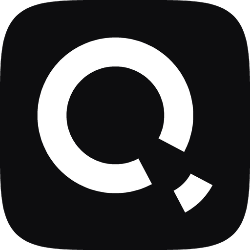

<div align="center">
  
</div>

# Queen MQ

**The queue that doesn't fall apart at the other end of your workload.**

Every entity gets its own FIFO lane, created on first push, so a slow consumer on one never
stalls another. That design has two ends, and one broker holds both.

**A million messages a second for 24 hours**: 86,369,975,300 messages with leases, explicit acks,
deduplication and retention all on, zero restarts, broker memory flat at 4.1 GB. 

And **a million ordered partitions** in one PostgreSQL, none preallocated, created during the run at a thousand a
second while serving 200,000 messages a second with zero push, pop or ack errors.

Consumer groups, replay and a dead-letter queue at both ends. Windowed aggregation that commits
its state, its output and its acks in one transaction. One stateless binary on the
PostgreSQL you already run. No cluster, no JVM.

[Every number above, with the conditions that make it true →](https://queenmq.com/benchmarks/comparison)

<div align="center">


[](LICENSE.md)
[](https://www.rust-lang.org/)
[](https://www.postgresql.org/)
[](https://nodejs.org/)
[](https://www.python.org/)
[](https://go.dev/)
[](clients/client-rust)
[](https://www.php.net/)

📚 **[Documentation](https://queenmq.com/)** · 🚀 **[Quickstart](https://queenmq.com/start/quickstart)** · 📊 **[Benchmarks](https://queenmq.com/benchmarks)** · 🛠 **[Develop](#developing-on-queen)**

</div>

Queen MQ is a message queue that keeps its data in PostgreSQL. A queue is split into
**partitions**, one per entity, created the first time you push to one. Each partition is a
strictly ordered lane that a consumer group drains independently, so ten thousand partitions
cost ten thousand index rows rather than ten thousand commit-log files or ten thousand
processes, and a consumer stuck on one lane never blocks another.

Everything else follows from that. The broker is one stateless Rust binary holding no cluster
membership and no partition assignments, so you scale it by starting another copy against the
same database. Clients speak plain HTTP and hold no coordination state either, so there is no
rebalancing protocol to wait out when a worker restarts. Durability, backup and replication are
whatever your PostgreSQL already does.

<div align="center">

</div>

## What you get

- **One ordered lane per entity, no preallocation.** Partitions are logical and created on first push.
- **Consumer groups with replay.** Each group keeps its own cursor per partition, and can be moved back to a timestamp or forward to the end.
- **Acknowledgement as an offset commit.** No per-message delivery state to store, scan or clean up.
- **Transactional handoff.** Acking one message and pushing the next stage's happens in a single PostgreSQL transaction.
- **Windowed aggregation in the same transaction.** Tumbling, sliding, session and cron windows over a queue, with the window state, the emitted messages and the source acknowledgement committing together or not at all. No changelog topic, no state store, no second system.
- **Exact, windowed deduplication.** A `transactionId` you supply makes a push idempotent inside a configurable window, enforced in the database rather than a cache.
- **Transactional key/value state, and messages scheduled for later**, both committing with your acks and pushes rather than beside them. Behind flags, off by default: see [Key/value state and timers](#keyvalue-state-and-timers).
- **A second storage class, for what should not be stored.** Ephemeral queues keep their contents in broker memory and survive nothing, so a request/reply inbox, a presence fan-out or a progress feed stops paying for a history nobody reads. See [Ephemeral queues](#ephemeral-queues).
- **A dead-letter queue, tracing, and a dashboard**, all served by the same binary.
- **Six client SDKs, an operator CLI, and a plain HTTP API**, so anything that can make an HTTP request is a first-class client.
- **An embeddable engine.** The broker is a Rust library before it is a binary: a product can run the same engine inside its own process instead of shipping a second container. See [Embedding the engine](#embedding-the-engine).

> *Why "Queen"? Because years ago, when I first read "queue", I read it as "queen" in my mind. The name stuck.*

Born at [Smartness](https://www.linkedin.com/company/smartness-com/) to power **Smartchat**, where
one ordered lane per chat session was the requirement that nothing else satisfied cheaply.

## Quickstart

```bash
docker network create queen
```

```bash
docker run --name qpg --network queen -e POSTGRES_PASSWORD=postgres -p 5433:5432 -d postgres:16
```

```bash
docker run -d --name queen --restart on-failure:10 -p 6632:6632 --network queen -e PG_HOST=qpg -e PG_PASSWORD=postgres ghcr.io/queen-mq/queen:latest
```

The broker creates its own schema on boot. `--restart on-failure:10` covers the seconds PostgreSQL
spends initialising on a first run: the broker refuses to start against a database it cannot reach,
and Docker brings it back as soon as it can. `curl -s http://localhost:6632/health` tells you when
it is up, and `docker logs queen` says why if it is not.

Then push and consume with the JavaScript SDK (`npm install queen-mq`):

```js
import { Queen } from 'queen-mq'

const queen = new Queen('http://localhost:6632')

// Queue and partition are created on first use.
await queen
  .queue('orders')
  .partition('customer-42')
  .push([{ data: { hello: 'world' } }])

// A group created after the push starts at the tail by default;
// subscriptionMode('all') points its new cursor at the beginning.
await queen
  .queue('orders')
  .group('billing')
  .subscriptionMode('all')
  .each()
  .consume(async (message) => {
    console.log(message.data)
  })
```

or with curl, from anything:

```bash
curl -X POST http://localhost:6632/api/v1/push -H "Content-Type: application/json" -d '{"items":[{"queue":"demo","payload":{"hello":"world"}}]}'
```

```bash
curl "http://localhost:6632/api/v1/pop/queue/demo?autoAck=true"
```

An empty pop answers `204` with no body at all. The dashboard is at
[http://localhost:6632](http://localhost:6632).

Full walkthrough: **[queenmq.com/start/quickstart](https://queenmq.com/start/quickstart)**.

## Key/value state and timers

Two surfaces that share the log's transaction instead of sitting beside it.

**Key/value** (`POST /api/v1/kv`) is a namespaced store with `get`, `getMany`, `getPrefix`, `put`,
`putIfAbsent`, `delete` and `incr`. Its point is not the store: it is that the idempotency marker,
the message it guards and the cursor advance commit together. Every write states its lifetime,
exactly one of `ttlSeconds` and `forever`, because a marker with no expiry is how a table grows in
silence.

**Timers** (`POST /api/v1/timers`) schedule a message into a queue for later, keyed by
`(queue, timerKey)` so a reschedule is the same upsert and a retry after a crash is safe. At fire
time the staging row is deleted and the message appended in one transaction, so there is no
half-delivered state.

```js
// Do the bundle at most once: the marker, the push and the ack commit or roll back together.
const res = await queen.transaction()
  .ack(message)
  .queue('emails').push([{ data: mail }])
  .once('sent', message.transactionId, { ttl: '24h' })
  .commit()

if (res.success === false) return  // a redelivery. Already done, nothing was sent twice.

// Not before 30 minutes from now, into a real queue, through the real log.
await queen.timer('reminders').key(orderId).delay('30m').payload({ orderId }).schedule()
```

Three things to know before you reach for them:

- **Neither is behind a flag.** There is no `QUEEN_KV_ENABLED` and no `QUEEN_TIMERS_ENABLED`, for
  the same reason there is no `QUEEN_PUSH_ENABLED`: every broker serves both surfaces from its first
  boot. What an operator has is a runtime kill switch for pausing one during an incident, which
  answers **503** and never 404.
- **A verdict is not an error.** A lost `putIfAbsent`, a key that is not there, a cancel that found
  nothing: all HTTP 200 with an explicit field. `applied: false` is the most frequent outcome of
  this API, and the SDKs return it rather than raising, so it stays out of your retry policy.
- **A cancel that answers `absent` may mean already delivered.** A fired timer leaves no tombstone,
  so `absent` means "no longer pending". The authority is the log: the answer carries the `txn` the
  delivered message would have.

Guides: **[queenmq.com/use/kv](https://queenmq.com/use/kv)** ·
**[queenmq.com/use/timers](https://queenmq.com/use/timers)**. How they work:
**[internals/kv](https://queenmq.com/internals/kv)** ·
**[internals/timers](https://queenmq.com/internals/timers)**.

## Ephemeral queues

A queue whose contents live in the broker's memory and survive nothing: a clean exit, a crash, a
deploy and a move to another broker each leave it empty, and none of those is a fault. What does
survive is the configuration of a declared queue, which comes back as configured and empty. It is
its own route family, `/api/v1/ephemeral/*`, and its own SDK namespace, `queen.ephemeral`, with
six verbs and two status reads. It shares the broker process with the durable engine and nothing
else: no table, no stored procedure, no code path.

```js
// An inbox nobody declared, created by the message that names it.
await queen.ephemeral.push(`rpc-inbox-${id}`, [{ n, squared: n * n }])

// A long poll parked on a memory gate: no database in the path, no polling interval.
const { messages } = await queen.ephemeral.pop(`rpc-inbox-${id}`, {
  wait: true, timeout: 5000, autoAck: true
})
```

Three things to know before you reach for them:

- **The class decides what can be lost, the ack mode decides the guarantee.** `autoAck` is
  at-most-once. An explicit ack is at-least-once for as long as the owning broker lives, because an
  unacknowledged message redelivers when its lease expires. Consumers still need to be idempotent,
  exactly as on a durable queue.
- **Consumption semantics come from the consumer group**, exactly as on a durable queue: one shared
  group competes, a group per subscriber fans out, no group at all is queue mode. There is no
  queue-level mode to choose.
- **`ttlSeconds` is not `retention`.** It drops messages nobody consumed. Durable retention cleans
  consumed history and never touches a pending message. One word per contract.

Runnable: `examples/35-ephemeral-basics.js` and `examples/36-ephemeral-reqreply.js`.
Guide: **[queenmq.com/use/ephemeral](https://queenmq.com/use/ephemeral)**. Routes:
**[reference/http/ephemeral](https://queenmq.com/reference/http/ephemeral)**.

## Developing on Queen

The only thing you need in a container is PostgreSQL. The broker builds and runs natively,
which keeps the edit-compile-run loop fast and lets you attach a debugger.

**1. PostgreSQL in a container.** Nothing else goes in Docker.

```bash
docker run --name queen-dev-pg -e POSTGRES_PASSWORD=postgres -p 5432:5432 -d postgres:16
```

**2. Run the broker from source.** Every connection default already matches that container
(`PG_HOST=localhost`, `PG_PORT=5432`, `PG_USER=postgres`, `PG_PASSWORD=postgres`,
`PG_DATABASE=postgres`), so there is nothing to configure:

```bash
cd server && cargo run
```

The broker applies its schema at every boot under an advisory lock, so there is no migration
step and no ordering to get right. It listens on `:6632`.

**3. Point something at it.** Any SDK, `curl`, or the CLI:

```bash
cd clients/client-cli && go run . --server http://localhost:6632 status
```

The repository's `go.work` is what makes that build against the `client-go` in this tree
rather than the last published one, so run it from inside the repository.

**4. Run the tests.** Unit tests need nothing:

```bash
cd server && cargo test
```

The full client matrix builds throwaway stacks in Docker and runs every language suite against
a freshly built broker, on a single-node stack and on a two-broker mesh:

```bash
test/run.sh
```

### Three things to know before you build

- **The SQL lives inside the binary.** `server/sql/schema.sql` and everything under
  `server/sql/procedures/` is embedded with `include_str!` at compile time. Editing a `.sql`
  file and restarting is not enough: you have to rebuild, or you will be running the previous
  version of your own stored procedure.
- **So does the dashboard.** `server/src/handlers/static_files.rs` embeds `server/webapp/dist`
  at compile time. To work on the UI, build it into place and rebuild the broker:
  `cd app && npm install && npm run build` writes straight into `server/webapp/dist`.
- **`/health` talks to the database.** It answers `503` when PostgreSQL is unreachable, which is
  correct for readiness and wrong for liveness. Do not wire it to a restart policy.

More: **[Contributing](CONTRIBUTING.md)** ·
**[queenmq.com/internals/contributing](https://queenmq.com/internals/contributing)**

## Clients

| Language | Package | Source |
| --- | --- | --- |
| JavaScript / TypeScript | `queen-mq` (npm) | [clients/client-js](clients/client-js) |
| Python | `queen-mq` (PyPI) | [clients/client-py](clients/client-py) |
| Go | `github.com/smartpricing/queen/clients/client-go` | [clients/client-go](clients/client-go) |
| Rust | `queen-mq` (crates.io) | [clients/client-rust](clients/client-rust) |
| PHP / Laravel | in this tree, not yet on Packagist | [clients/client-laravel](clients/client-laravel) |
| C++ | single header | [clients/client-cpp](clients/client-cpp) |
| CLI | `queenctl` | [clients/client-cli](clients/client-cli) |

All of them speak the same HTTP API, which is documented in full and published as
[OpenAPI 3.1](https://queenmq.com/reference/openapi) generated from the router itself.

The Rust client is the one exception to "an SDK re-describes the wire by hand": it and the
broker both depend on [`crates/queen-protocol`](crates/queen-protocol), and the broker's own
tests round-trip its request parsers and rendered responses through those types. A renamed
field fails a test instead of reaching a client.

Key/value and timers reach the six SDKs, not `queenctl`, which has no `kv` or `timer` command in
1.0: its value there would be inspection, and `curl` already covers it. The C++ client wraps five
of the seven key/value operations and two of the four timer ones. The capability matrix, row by
row and including the boxes where parity is not there, is on every SDK reference page:
[queenmq.com/reference/sdk/javascript](https://queenmq.com/reference/sdk/javascript).

## Embedding the engine

The clients above talk to a broker. There is a second way in, for Rust products that want to
*be* one: the broker crate has a library target, and the same engine that serves HTTP in the
container runs inside your process. `Broker::start` connects to PostgreSQL, applies the
schema, starts the background machinery and hands back typed operations — push, pop with
long-poll, ack, leases, transactions, configure, delete, the DLQ, metrics. Each one invokes
the same handler functions the HTTP router dispatches to, so behaviour and defaults are the
broker's by construction, not a reimplementation's. What it buys you is one process to build,
version and supervise instead of two.

```toml
[dependencies]
queen-engine = { version = "1.0.0", default-features = false }
```

The package is named `queen-engine` — the bare crates.io name `queen` belongs to an unrelated
crate — but the library still imports as `queen`. `default-features = false` skips the HTTP
server, the dashboard and the tracing subscriber: an embedding application owns its own
surface and its own logging. (`queen-mq` remains the HTTP *client*; this crate is the broker.)

```rust
use queen::{Broker, BrokerConfig};
use queen::protocol as qp;

let broker = Broker::start(
    BrokerConfig::new().pg("localhost", 5432, "postgres", "postgres", "postgres"),
)
.await?;

broker.configure(&qp::ConfigureRequest::new("jobs")).await?;
broker.push(vec![qp::PushItem::new("jobs", serde_json::json!({"n": 1}))]).await?;
let popped = broker.pop("jobs", &qp::PopParams::default()).await?;
```

Boundaries to know before you build on it:

- One `Broker` per process lifetime: the admission arbiter is process-global.
- The outage spool defaults to a per-instance temp directory: set `spool_dir` if
  `status: "buffered"` pushes must survive a restart.
- The v1 surface is the data plane plus the DLQ; consumer-group administration, listings,
  traces and streams still need the HTTP surface.

The full list, and what N embedded instances over one PostgreSQL do, is at
[queenmq.com/use/embed](https://queenmq.com/use/embed).

Guide: **[queenmq.com/use/embed](https://queenmq.com/use/embed)** · API reference:
**[queenmq.com/reference/engine](https://queenmq.com/reference/engine)**.

## Repository layout

| Path | What it is |
| --- | --- |
| `server/` | The broker. Rust, package `queen-engine`, library `queen`, binary `queen`. Schema and stored procedures in `server/sql/`, embedded at compile time. |
| `proxy/` | Multi-tenant gateway: API keys, quotas, rate limits, metering, console. Its own PostgreSQL. |
| `app/` | The Vue dashboard, compiled into the broker binary. |
| `clients/` | The six SDKs and the `queenctl` CLI. |
| `crates/` | Crates shared between the broker and a client. Today: `queen-protocol`, the wire types — a regular dependency of both, and the request/response types of the embedded engine. |
| `webdoc/` | This project's documentation site (Astro). Large parts of it are generated from the source in `server/` and `proxy/`. |
| `test/` | The Docker test harness: every client suite against a freshly built broker. |
| `benchmark-queen/` | Benchmark sessions with their raw artifacts. Every number on the website comes from here. |
| `examples/`, `streams/` | Complete runnable examples: `examples/full/` in JavaScript, Python, Go and Rust, with a runner that asserts each one's outcome. |

## Documentation

The site is written from the current source, and its reference material is generated from it:
the route table, the environment-variable reference, the Prometheus family list, the proxy's
route classes, the OpenAPI documents and the benchmark figures are all derived at build time,
and CI fails when any of them falls behind the code.

- [Start here](https://queenmq.com/start): what Queen is, why it exists, and where its limits are
- [Use Queen](https://queenmq.com/use): the model, the SDKs, the embedded engine, worked examples
- [Self-hosting](https://queenmq.com/selfhost): deployment, PostgreSQL, high availability, security, operations, multi-tenancy
- [Internals](https://queenmq.com/internals): segments, offsets, the push and pop paths, the schema
- [Reference](https://queenmq.com/reference): routes, configuration, metrics, client APIs
- [Benchmarks](https://queenmq.com/benchmarks): the runs, their configuration, and their raw output

## Versions

Version **1.0.0** is a Rust broker on a new storage engine. The 0.16.x line was a C++
implementation on a row-based engine and is retired; its measurements and its architecture
documentation do not describe this release. See [CHANGELOG.md](CHANGELOG.md) and
[queenmq.com/reference/compatibility](https://queenmq.com/reference/compatibility).

## Contributing

Bug reports and feature requests are welcome through the
[issue templates](https://github.com/queen-mq/queen/issues/new/choose). Start from
[CONTRIBUTING.md](CONTRIBUTING.md). Security issues: [SECURITY.md](SECURITY.md).

## License

[Apache 2.0](LICENSE.md).

---

**Built with ❤️ by [Smartness](https://www.linkedin.com/company/smartness-com/)**
