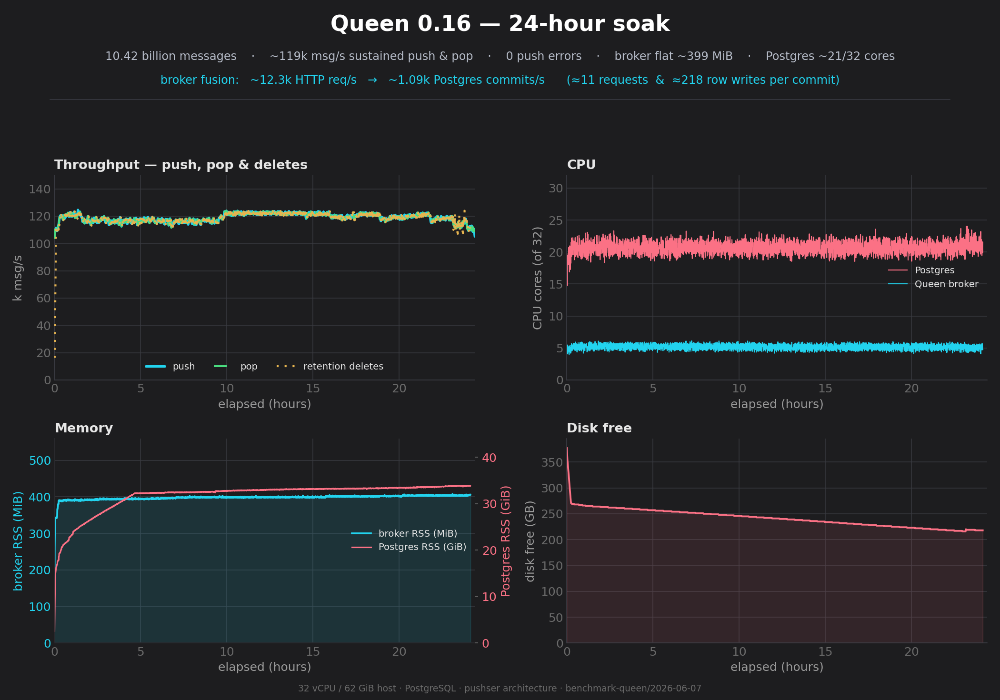

<div align="center">
  
</div>

# Queen MQ

**Kafka-style ordered partitions and consumer groups, on the Postgres you already run — one stateless binary, no JVM, no cluster.**

<div align="center">


[](LICENSE.md)
[](https://nodejs.org/)
[](https://www.python.org/)
[](https://go.dev/)
[](https://www.php.net/)
[](https://en.cppreference.com/w/cpp/17)
[](https://libuv.org/)
[](https://www.postgresql.org/)
[](https://github.com/uNetworking/uWebSockets)

📚 **[Complete Documentation](https://queenmq.com/)** • 🚀 **[Quick Start](https://queenmq.com/quickstart.html)** • ⚖️ **[Comparison & Benchmarks](https://queenmq.com/benchmarks.html)** • 🛠️ **[Contributing — Developer Guide](DEVELOPING.md)**

</div>

Queen MQ is a partitioned message queue backed by PostgreSQL, built with uWebSockets, libuv, and the libpq async API. It gives you unlimited FIFO partitions that process independently, consumer groups with replay, transactional delivery, dead-letter queues, tracing, and ACID-guaranteed durability — in a single stateless binary alongside the Postgres you already operate. Five client SDKs (JavaScript, Python, Go, PHP/Laravel, C++) share the same fluent grammar, and there is a plain HTTP API plus a built-in dashboard. An experimental PostgreSQL-extension variant is available as [pg_qpubsub](pg_qpubsub/README.md).

<div align="center">

<a href="https://queenmq.com/benchmarks-0.16-soak.html"></a>

<sub><b>24-hour soak</b> · 10.4 billion messages · ~119k msg/s balanced push &amp; pop · zero loss · flat ~400 MB broker · <a href="https://queenmq.com/benchmarks-0.16-soak.html">full report →</a></sub>

</div>

## What's new

**Queen 0.16.0** makes per-partition message timestamps commit-ordered under high concurrent push (closing a cursor-skip edge case), parses hot-path JSON with SIMD (simdjson), and splits the engine into three shared per-function instances — ~110–120k msg/s balanced push & pop (~190k push-only) on a 32-core host, validated by the 24-hour, 10.4-billion-message, zero-loss soak above.
HTTP contract unchanged: all ≥0.14.0 clients work as-is. **[Release notes →](https://github.com/queen-mq/queen/releases/tag/v0.16.0)**

## Why Queen?

> *Why "Queen"? Because years ago, when I first read "queue", I read it as "queen" in my mind. The name stuck.*

Born at [Smartness](https://www.linkedin.com/company/smartness-com/) to power **Smartchat**, Queen solves a unique problem: **unlimited FIFO partitions** where slow processing in one partition doesn't block others.

Perfect for:

- **One ordered lane per entity, no preallocation** — 10,000 partitions cost index rows, not 10,000 commit-log files. A partition is created on first push; a slow consumer on one partition never stalls another.
- **Transactional integration with PostgreSQL** — ACK and push in a single PG transaction.
- **Fan-out with fairness** — consumer groups each get a full copy of every message; the adaptive engine keeps delivery fair across groups at sub-linear CPU cost.
- **~70 MB broker at 172k msg/s peak; flat ~400 MB across a 24h / 10.4B-message soak** — no JVM, no Erlang, no cluster to operate. One Docker container plus your existing Postgres.
- **Replay and DLQ** — rewind any consumer group to any timestamp; failed messages surface in a per-queue dead-letter queue automatically.
- **Zero message loss, verified** — 10.4 billion messages in a 24-hour soak (plus 1.6 billion across the April suite), zero lost, zero duplicates.

## Quick Start

Create a Docker network and start PostgreSQL and Queen Server:

```bash
# Create a Docker network for Queen components
docker network create queen

# Start PostgreSQL
docker run --name qpg --network queen -e POSTGRES_PASSWORD=postgres -p 5433:5432 -d postgres

# Wait for PostgreSQL to start
sleep 2

# Start Queen Server (defaults are production-sane; tuning vars in the server docs)
docker run -p 6632:6632 --network queen -e PG_HOST=qpg -e PG_PORT=5432 -e PG_PASSWORD=postgres smartnessai/queen-mq:0.16.0
```

Then push and consume — with the JavaScript SDK (`npm install queen-mq`):

```js
import { Queen } from 'queen-mq'

const queen = new Queen('http://localhost:6632')

// Push — queue and partition are created on first use
await queen
  .queue('orders')
  .partition('customer-42') // one ordered lane per entity
  .push([{ data: { hello: 'world' } }])

// Consume with a consumer group, then ack the input and push
// to the next queue in a single PostgreSQL transaction
await queen
  .queue('orders')
  .group('billing')
  .autoAck(false)
  .each()
  .consume(async (message) => {
    return { charged: true } // process the message
  })
  .onSuccess(async (message, result) => {
    await queen
      .transaction()
      .ack(message, 'completed', { consumerGroup: 'billing' })
      .queue('invoices')
      .partition('customer-42')
      .push([{ data: result }])
      .commit() // ack + push succeed or fail together
  })
  .onError(async (message, error) => {
    await queen.ack(message, false, { group: 'billing' }) // retry via lease, then DLQ
  })
```

or with cURL (works from any language):

```bash
# Push
curl -X POST http://localhost:6632/api/v1/push \
  -H "Content-Type: application/json" \
  -d '{"items": [{"queue": "demo", "payload": {"hello": "world"}}]}'

# Consume
curl "http://localhost:6632/api/v1/pop/queue/demo?autoAck=true"
```

Then go to the dashboard ([http://localhost:6632](http://localhost:6632)) to see the messages and the status of the queue. For a complete example with queue configuration, lease renewal, and batching, see [examples/base.js](examples/base.js).

## Queen vs Kafka / RabbitMQ / pgmq

**vs Kafka** — Kafka gives you ordered partitions, but a *fixed* number of physical shards: entities are hash-modded onto them, so one slow consumer stalls every entity that shares its shard. Queen partitions are logical lanes — one per entity, created on first push, costing index rows instead of commit-log files. And there is no broker cluster, no ZooKeeper/KRaft, no JVM to operate.

<div align="center">

</div>

**vs RabbitMQ** — per-entity ordering in RabbitMQ means one queue per entity: 10,000 ordered streams ≈ 10,000 Erlang processes at ~245 KB each. Queen keeps one queue with 10,000 logical partitions as Postgres rows.

<div align="center">

</div>

**vs pgmq** — also Postgres-backed, and at the SQL-engine level they are equally fast (~1.4 ms/op). The differences are architectural: Queen does ordered fan-out through consumer groups at **1× writes** (pgmq fans out via one queue per group ≈ N× writes), with **no UPDATE+DELETE churn** and **~8× fewer active Postgres backends** under high concurrency. pgmq wins single-op latency at low load — the broker hop Queen can skip entirely with [pg_qpubsub](pg_qpubsub/README.md). Full like-for-like methodology in [benchmark-queen/pgmq/QUEEN-vs-PGMQ.md](benchmark-queen/pgmq/QUEEN-vs-PGMQ.md).

⚖️ Numbers, methodology, and the full comparison: **[queenmq.com/benchmarks.html](https://queenmq.com/benchmarks.html)**

## Documentation

📚 **[Complete Documentation](https://queenmq.com/)**

### Getting Started

- [Quick Start Guide](https://queenmq.com/quickstart.html)
- [Basic Concepts](https://queenmq.com/concepts.html)
- [Architecture](https://queenmq.com/architecture.html)
- [Benchmarks](https://queenmq.com/benchmarks.html) · [Sizing calculator](https://queenmq.com/sizing.html)

### Client Libraries & API

- [Client libraries overview](https://queenmq.com/clients.html) — JavaScript, Python, Go, PHP / Laravel, C++ (same fluent grammar across all five)
- [HTTP API Reference](https://queenmq.com/http-api.html)
- [`queenctl` CLI](https://queenmq.com/cli.html) — single-binary operator CLI built on `client-go`

### Operate

- [Server setup](https://queenmq.com/server.html) — env vars, Docker, Kubernetes, multi-instance UDP sync, JWT auth, proxy
- [Dashboard tour](https://queenmq.com/dashboard.html)

---

## Structure of the repository

The repository is structured as follows:

- `lib`: C++ core queen library (libqueen), implementing libuv loops, sql schema and procedures
- `server`: Queen MQ server, implementing the HTTP API that talks to the libqueen library
- `pg_qpubsub`: PostgreSQL extension for using queen-mq semantics as a PostgreSQL extension
- `clients/client-js`: JavaScript client library (browser and node.js)
- `clients/client-py`: Python client library (python 3.8+)
- `clients/client-go`: Go client library (go 1.24+)
- `clients/client-laravel`: PHP / Laravel client library (php 8.3+)
- `clients/client-cpp`: C++ client library (cpp 17)
- `clients/client-cli`: `queenctl` operator CLI (Go binary built on `client-go`)
- `proxy`: Proxy server (authentication)
- `app`: Vue.js dashboard (vue 3)
- `docs`: Documentation website (vitepress)
- `examples`: JS client examples
- `streams`: JS client streaming examples

---

## Versions & compatibility

JS clients from version 0.12.0 can be run inside a browser.

| Server | Compatible clients |
| ------ | ------------------ |
| **0.16.0** | All ≥0.14.0 clients work unchanged (HTTP contract identical); 0.16.0 SDKs are a version-aligned release |
| **0.15.x** | All ≥0.14.0 clients; upgrade to ≥0.15.0 clients for the streaming SDK |
| **0.14.x** | All ≥0.13.x clients; upgrade to 0.14.0 clients for `maxPartitions` |
| **0.13.0** | All ≥0.12.x clients |
| **≤0.12.x** | JS ≥0.7.4, Python ≥0.7.4 |

Full release history and per-version details: **[CHANGELOG.md](CHANGELOG.md)** · **[GitHub Releases](https://github.com/queen-mq/queen/releases)**

---

## Contributing

Bug reports and feature requests are welcome through the [issue templates](https://github.com/queen-mq/queen/issues/new/choose). To build, run, and test any component, start from [CONTRIBUTING.md](CONTRIBUTING.md) and the [developer guide](DEVELOPING.md). Security issues: see [SECURITY.md](SECURITY.md).

## License

Queen MQ is released under the [Apache 2.0 License](LICENSE.md).

---

**Built with ❤️ by [Smartness](https://www.linkedin.com/company/smartness-com/)**
