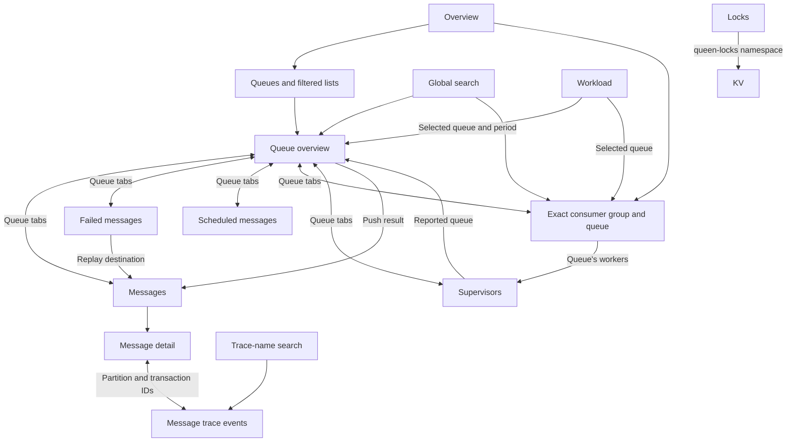

# Queen Dashboard

A beautiful, modern dashboard for monitoring and managing Queen message queues.

## Features

Three theme preferences in the header: **System**, **Light** and **Dark**.
System is the default and follows changes to the device's colour scheme live
(falling back to dark when no preference is available). Light and Dark stay fixed
and persist on this device; choosing System clears that override.

- **Real-time charts** — throughput, lag and resource series, on a shared ticker
- **Queues** — the list, **create a queue**, and a detail page that reads all 21 options and
  edits the eighteen this broker enforces. An edit sends only the fields that changed
  (`/configure` merges) and a cleared field sends `null`, which restores that option's
  default. `ttl`, `maxSize` and `retryDelay` are shown read-only: the broker stores and
  echoes them and reads them nowhere
- **Messages** — browse, filter, inspect one message, delete a dead-letter record, and
  **push**: one modal behind three entry points (the listing, a queue's detail page with the
  queue fixed, and **Push a copy** in the message drawer). A copy is a new message, never a
  retry; the original is untouched
- **Dead Letter** — the listing with a failure breakdown, per-row **replay** and purge, and a
  bulk purge by queue and consumer group. Replay runs on the broker's move primitive
  (`POST /api/v1/dlq/:id/replay`): it moves exactly the record it addressed, leaves any
  sibling consumer group's record alone, and the confirmation names the destination and the
  `dlq:<row id>` transaction id the replayed message will carry. An Advanced fold retargets it
  to another queue and partition, always as a whole pair
- **KV** — a read-only browser over one namespace at a time: a prefix box, a keyset pager
  rather than page numbers, and expired-but-unswept rows shown greyed rather than hidden. No
  writes, by design
- **Timers** — scheduled messages per queue: keyset list, exact count for a key prefix, a peek
  drawer that decodes the payload in the browser, and cancel. No auto-refresh, because every
  row is a database read on a metered route
- **Locks** — who holds each lock and semaphore permit: the holder, since when, its last
  renewal and when it expires. A permit is a KV row, so the page is the KV listing asked for
  the namespace `queen-locks` and a viewer can open it. Read-only: the drawer shows the guard
  a transaction carries and the release call for the lease period on screen, and sends neither
- **Consumer Groups** — health, lag, subscription changes, seek, delete
- **Message Tracing** — cross-message trace timeline viewer
- **Workload** — who is doing the work, grouped by namespace or task and drilled down to a
  queue: flow, lag, acks, dead letters, retention
- **Settings** — the lines the console judges by, for the tenant and per queue: one JSON
  document in the tenant's KV (`queen.console` / `settings`)
- **Ephemeral** — the in-memory queue class, on its own page
- **System** and **Users** — cell-level health, PostgreSQL internals (or, on a raft-mode broker,
  the replicated log and the Raft cluster's members) and account management (operators only;
  both say "cell" on screen)

There is **no pop inspector**, and there will not be one: a pop from a console takes a lease,
steals from a real consumer and burns a retry attempt with nobody to ack it.

The sidebar groups the views by activity: Overview; **Messaging** (Queues, Ephemeral,
Messages, Dead letter, Timers, KV, Locks); **Workers** (Consumer groups, Supervisors);
**Analysis** (Workload, Traces, Settings); **Access** (Members, API keys); and **Cell**
(System). Users has no row of its own: it is reached from Members.

## Navigation paths

The sidebar opens each section's general view. Opening a queue starts a contextual
journey: the queue stays visible above the page, and its tabs switch between views
of that same queue. The return link leads to the original list or analysis, with its
filters intact. A direct queue URL returns to Queues.



Ephemeral queues, access management and cell administration remain separate sidebar
destinations because they describe different resources or scopes. Trace-name searches
can span multiple queues; queue investigations reach traces through an actual message.
Operations labels its tenant/cell panels separately from the selected queue's charts.

Links use `composables/navigation.js` for encoded identities, the investigation period
and a dashboard-only `returnTo`. `useRouteState` restores list filters on initial load,
same-page navigation and browser Back/Forward. Page-local filters such as status and
pagination stay local; queue tabs carry the queue, applied period and origin. Analysis
pages use `useRouteRange` so custom inputs enter the URL only after Apply. KV prefixes
and keyset cursors are deliberately not stored in the URL. Paged record lists start at
25 items; the Queues count distinguishes matching queues from the loaded total.

## Tech Stack

- **Vue 3** - Progressive JavaScript framework
- **Vite** - Lightning fast build tool
- **Tailwind CSS** - Utility-first CSS framework
- **Chart.js** - Beautiful responsive charts
- **Vue Router** - Client-side routing
- **Ky** - Fetch-based HTTP client

## Getting Started

### Prerequisites

- Node.js 24+ (the rest of the monorepo targets Node 24; we recommend using nvm)
- npm

### Installation

```bash
# Navigate to the app directory
cd app

# Install dependencies
npm install

# Start development server
npm run dev
```

The app will be available at `http://localhost:4000`, proxying `/api`, `/auth`,
`/health` and `/metrics` to the queen-proxy dev cell on `:6711`
(`proxy/scripts/dev-cell.sh up`). Set `QUEEN_DEV_UPSTREAM=http://localhost:6632`
to talk to a broker directly instead — the STANDALONE mode: the broker answers
`/auth/me` itself with a fixed operator identity (`standalone: true`, one
synthetic `local` cluster; server/src/handlers/standalone.rs) and the shell
hides the session UI. It exercises no sessions, no tenancy, no role checks and
no 429s, so develop against the proxy unless standalone is the thing you are
working on.

### Build for Production

```bash
npm run build
```

The output goes straight to `server/webapp/dist` — the ONE artifact both Rust
binaries embed at compile time:

* `server/src/handlers/static_files.rs` — `#[folder = "webapp/dist"]`
* `proxy/src/webapp.rs` — `#[folder = "../server/webapp/dist"]`

Because the bytes are baked in, **a source change ships only after
`npm run build` AND a `cargo build` of whichever binary serves it.** Debug
builds of rust-embed read from disk, so locally the npm build alone is usually
enough; release builds are not.

### Tests

```bash
npm test
```

Node's own runner (`node --test test/*.test.js`), no framework and no extra
dependency — the same shape as `clients/client-js/test-v2/*-unit`. It covers the
rules views share rather than the markup around them: the pure modules under
`src/composables`, which is where a rule belongs the moment a second view needs
it. Rendering tests would need `@vue/test-utils` and a DOM in devDependencies;
there are none today.

## Configuration

### Environment Variables

Create a `.env` file in the app directory:

```env
# API Base URL (defaults to '' which uses the proxy)
VITE_API_BASE_URL=

# Optional: Override API endpoint for production
VITE_API_BASE_URL=http://your-queen-server:6632
```

### API Proxy

In development the Vite dev server proxies to the queen-proxy (`:6711`), not the
broker: auth, tenancy, role checks and rate limits all live there. Override with
`QUEEN_DEV_UPSTREAM`. `QUEEN_APP_BASE` sets the router/asset base if the app is
ever mounted under a path prefix.

## Shell contract

The shell owns identity, errors and the acting cluster. Views must not
re-implement any of it.

| Need | Use | Never |
|---|---|---|
| Who am I / what may I show | `useIdentity()` from `@/stores/identity`, `can('read'\|'produce'\|'consume'\|'queueAdmin'\|'operator')` | parse a role, infer from a 403 |
| Acting tenant / cluster | `actingCluster`, `actingTenantSlug`, `actingClusterSlug` | read a header, a hostname |
| Report a local outcome | `useToast()` from `@/composables/useToast` | `alert()` / `confirm()` |
| API failure | catch the `ApiError` (`status`, `code`, `retryAfter`) and render an inline state | swallow it — it is already on the global surface |
| Panel state | `useApi()` from `@/composables/useApi` (`data/loading/error/lastUpdated`) | render `0` for an unknown |
| Polling | `useAutoRefresh(cb)` from `@/composables/useRefresh` | a private `setInterval` |
| Cell-level numbers | `operator.*` in `@/api`, and say "cell" on screen | present them as the tenant's |

`x-queen-act-cluster` is attached by the shared HTTP request hook, once, for
every `/api/v1/*` call. No view sends it.

## Project Structure

```
app/
├── public/                       # Static assets
├── src/
│   ├── api/                      # API client and endpoints
│   ├── components/               # Reusable Vue components
│   │   ├── Autocomplete.vue      # opt-in commit-on-blur for write forms
│   │   ├── BaseChart.vue
│   │   ├── ConsumerHealthGrid.vue
│   │   ├── DataTable.vue
│   │   ├── DetailDrawer.vue
│   │   ├── Header.vue
│   │   ├── JsonViewer.vue
│   │   ├── MetricCard.vue
│   │   ├── MetricRow.vue
│   │   ├── MultiSelect.vue
│   │   ├── PushMessageModal.vue  # the one push form, three entry points
│   │   ├── QueueConfigModal.vue  # create and edit, diffed against the echo
│   │   ├── QueueHealthGrid.vue
│   │   ├── RaftCluster.vue       # System's Raft source: quorum strip + members
│   │   ├── RowChart.vue
│   │   └── Sidebar.vue
│   ├── composables/              # Vue composables (pure rules live here)
│   │   ├── useApi.js             # panel state: data/loading/error/lastUpdated
│   │   ├── useChartTheme.js
│   │   ├── useConflation.js      # last-value groups: log depth vs work depth
│   │   ├── useDlqReplay.js       # replay request + the broker's verdict
│   │   ├── useEngine.js          # Postgres or raft, from the /health answer
│   │   ├── useGatedVerdict.js    # absent / gated / paused / transient
│   │   ├── useKeysetPager.js     # cursor stack: no page numbers, no totals
│   │   ├── useKvView.js          # KV list body, expiry and state copy
│   │   ├── useLocks.js           # a KV row as a permit; the guard and release it prints
│   │   ├── usePushVerdict.js     # PushStatus -> what the modal says
│   │   ├── useQueueConfig.js     # the 21-option catalogue, diff, validate
│   │   ├── useRaftCluster.js     # member rows, quorum, the raft alert
│   │   ├── useRefresh.js         # shell refresh registry + shared ticker
│   │   ├── useTheme.js           # System, Light and Dark preferences
│   │   ├── useTimers.js          # broker instants, payload decode, verdicts
│   │   └── useToast.js           # notifications
│   ├── stores/                   # module singletons
│   │   ├── engine.js             # the acting cell's engine, shared /health
│   │   ├── identity.js           # /auth/me, roles, acting cluster
│   │   ├── queuesStore.js        # tenant-keyed queue cache
│   │   ├── routeSupport.js       # remembers a route this broker does not serve
│   │   └── ui.js                 # global error / toast surface
│   ├── router/                   # routes + nav groups + role metadata + guard
│   ├── views/                    # Page components
│   │   ├── Consumers.vue
│   │   ├── Dashboard.vue
│   │   ├── DeadLetter.vue
│   │   ├── Ephemeral.vue
│   │   ├── Kv.vue
│   │   ├── Locks.vue
│   │   ├── Messages.vue
│   │   ├── QueueDetail.vue
│   │   ├── Queues.vue
│   │   ├── System.vue
│   │   ├── Timers.vue
│   │   ├── Traces.vue
│   │   ├── Users.vue
│   │   └── Workload.vue
│   ├── App.vue                   # Root component
│   ├── main.js                   # Entry point
│   └── style.css                 # Global styles & design system
├── test/                         # node --test unit tests (npm test)
├── index.html
├── package.json
├── tailwind.config.js
└── vite.config.js
```

## Design System

### Colors

Tokens live in `src/style.css` — use the CSS variables, not hex literals.

- `--brand` / `--accent` — sunflower yellow from the logo (`#fcc620`), with black text on primary buttons
- `--accent-text` / `--crown-*` — yellow in dark mode, dark gold in light mode for readable text and focus rings
- `--ice-*` / `--ok-*` — neutral idle and healthy states
- `--ember-*` — coral for failures
- `--warn-*` — amber for warnings
- `--scope-*` — neutral operator/cell-level indicators

Keep the brand and surface tokens aligned with `webdoc/src/styles/globals.css`.

### Components

The app includes several reusable components:

- `MetricCard` - Display metrics with icons, trends, and progress bars
- `BaseChart` - Wrapper for Chart.js with theme support
- `DataTable` - Sortable, paginated tables with custom templates
- `Sidebar` - Navigation (derived from route meta + identity), cell health
- `ClusterSelector` - Acting tenant / cluster, present on every route
- `ToastHost` - The one place a failure becomes visible
- `Header` - Search and refresh

## License

Apache 2.0 — see [`../LICENSE.md`](../LICENSE.md).
