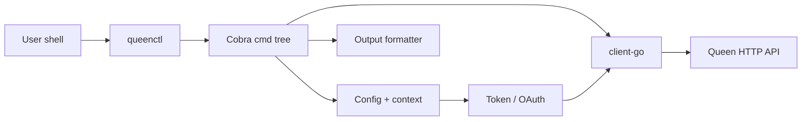

# 15 — queenctl CLI

`queenctl` is the operator CLI for Queen MQ, living at
`[clients/client-cli/](../clients/client-cli/)` and built on top of the
[Go SDK](../clients/client-go/). It mirrors the broker's full HTTP surface
(data plane + admin plane) through a kubectl-style command tree.

## Architecture




The CLI is a thin frontend. Every command:

1. Loads the resolved context (`internal/config`).
2. Builds a `*queen.Queen` client (`internal/sdk`).
3. Calls one or two `Admin` / `QueueBuilder` methods.
4. Pipes the result through `internal/output.Renderer`.

This keeps logic in `client-go` so the JS / Python / PHP / C++ SDKs benefit
from the same admin surface.

## Layout

```
clients/client-cli/
  main.go               -- 5-line entry point
  cmd/                  -- one file per command (root, ping, status, ...)
  internal/
    config/             -- ~/.queen/config.yaml + keychain
    output/             -- formatter (table | json | ndjson | yaml | jsonpath)
    timefmt/            -- "5m ago", RFC3339, unix - the time-flag parser
    auth/               -- proxy login + Google OAuth
    errors/             -- typed exit codes (0/1/2/3/4)
    sdk/                -- *queen.Queen + Admin handle bundle
  tests/                -- gated end-to-end smoke tests (QUEEN_E2E=1)
  Makefile              -- build / install / test / release / completion
  .goreleaser.yaml      -- multi-OS/arch release pipeline
```

## How to add a command

1. Create `cmd/<name>.go` with a `cobra.Command` value.
2. Register it in `init()` via `rootCmd.AddCommand(...)` (or
  `parentCmd.AddCommand(...)` for sub-commands).
3. Inside `RunE`:
  - Get a connected client with `newClient()`.
  - Call the relevant `client-go` methods (prefer `Admin` over raw HTTP).
  - Build an `output.View` describing the columns and how to extract row
  slices, then call `rendererFor(view, stdout()).Render(data)`.
4. Wrap any error you propagate with the right `clierr.User|Server|Auth`
  helper so the exit code is right.
5. Add a unit test under `internal/<pkg>/*_test.go` if there's pure logic
  to cover (parsing, formatting, etc.).

For commands that need server-side endpoints not yet exposed in
`client-go/admin.go`, prefer adding the method to `Admin` rather than
calling raw HTTP from the CLI - the SDK is the single source of truth.

## Adding tests


| Layer | Where                         | What                                           |
| ----- | ----------------------------- | ---------------------------------------------- |
| Unit  | `internal/*/*_test.go`        | Pure functions: parsers, formatters, config    |
| Auth  | `internal/auth/login_test.go` | `httptest`-backed login flows                  |
| E2E   | `tests/smoke_test.go`         | Real broker via Docker, gated by `QUEEN_E2E=1` |


Local CI uses `make test` which runs all of these except E2E. `make build`
is then exercised in `.github/workflows/cli.yml` on Linux + macOS.

## Release process

The CLI ships independently of the broker, on its own tag:

```bash
git tag -a client-cli/v0.1.0 -m "queenctl 0.1.0"
git push origin client-cli/v0.1.0
```

The tag triggers `.github/workflows/release-cli.yml` which runs
`goreleaser` to:

- Cross-compile for linux/{amd64,arm64}, darwin/{amd64,arm64}, windows/amd64
- Generate `checksums.txt`
- Upload archives to GitHub Releases
- Update the Homebrew tap (`smartpricing/homebrew-tap`) via the
`HOMEBREW_TAP_TOKEN` secret

`-ldflags` embeds version + commit + date into the binary, surfaced by
`queenctl version`.

See [14-release.md](14-release.md) for the cross-artifact release order
(broker first, then JS, Python, Go SDK, CLI, PHP, C++).