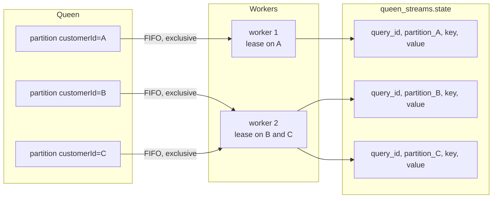
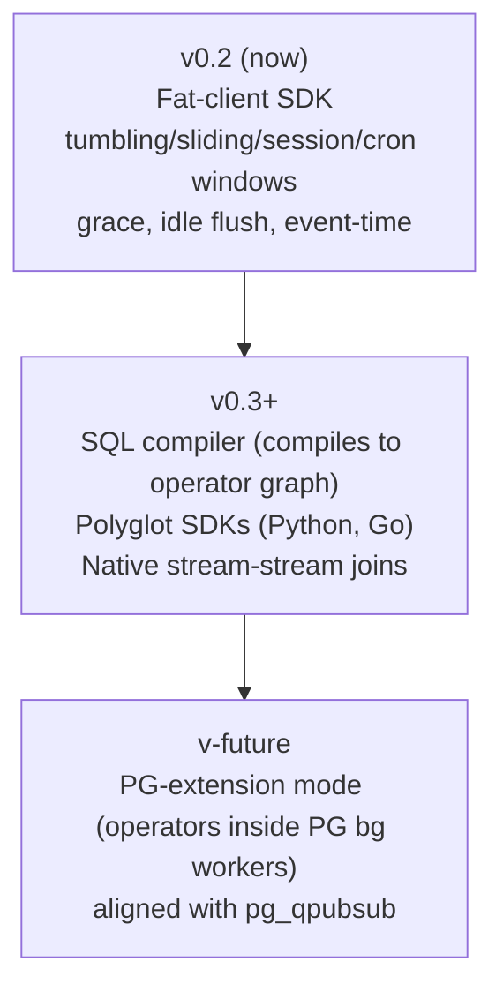

# @queenmq/streams

> Fat-client streaming engine on top of [Queen MQ](https://queenmq.com/). Operators run in your Node process; **state, sink push, and source ack commit in one Postgres transaction.**

```js
import { Queen } from 'queen-mq'
import { Stream } from '@queenmq/streams'

const q = new Queen('http://localhost:6632')

await Stream
  .from(q.queue('orders'))                  // partitioned by customerId on push
  .windowTumbling({ seconds: 60 })          // implicitly keyed by partition (customerId)
  .aggregate({ count: () => 1, sum: m => m.data.amount })
  .to(q.queue('orders.totals_per_customer_per_min'))
  .run({ queryId: 'orders.per_customer_per_min', url: 'http://localhost:6632' })
```

That's the whole pipeline: a Queen consumer-group-backed loop in your Node
process, with windowed aggregation state stored in `queen_streams.state`,
sink push to Queen's `orders.totals_per_customer_per_min`, and source ack
all committed in one PG transaction.

---

## What you get in v0.2

| Capability | Status |
|---|---|
| Stateless `map` / `filter` / `flatMap` | Yes |
| **Tumbling**, **sliding/hopping**, **session**, and **calendar (cron)** windows | Yes |
| Grace period — accept events for `windowEnd + grace` before closing | Yes |
| Idle flush — close ripe windows on quiet partitions on a per-window timer | Yes |
| **Event-time mode** — `eventTime: m => ...` extractor; per-partition watermarks | Yes |
| Allowed-lateness + `onLate: 'drop' \| 'include'` policy | Yes |
| Per-key `aggregate({ count, sum, min, max, avg })` | Yes |
| `keyBy` to override the implicit partition-key | Yes |
| `to(queue)` sink (atomic with state + ack) | Yes |
| `foreach(fn)` terminal at-least-once side effect (with `(value, ctx)` signature) | Yes |
| Multi-partition pop (sticky leases via Queen's v4 pop) | Yes |
| Crash-resume from cursor + state reconciliation | Yes |
| Exactly-once on the sink queue | Yes |
| Stream-stream joins as a native operator | **Not yet** (workaround: co-partitioned intermediate queue) |
| SQL DSL | **Not yet** |
| Polyglot SDKs (Python, Go) | **Not yet** |

See [Roadmap](#roadmap) below for what comes next.

---

## Why @queenmq/streams (and not Materialize / RisingWave / Flink)

Five things this architecture delivers that no major streaming engine can credibly answer, all because state lives in the same Postgres as Queen's messages:

1. **Exactly-once is one Postgres transaction.** State update + sink push + source ack commit together via `streams_cycle_v1`. No Kafka transactional producer, no two-phase commit, no idempotent-key gymnastics.
2. **Streaming state is queryable via plain SQL.** `SELECT * FROM queen_streams.state WHERE query_id = ...` works. Build dashboards on it.
3. **Stream-table joins are free.** Your business tables live in the same Postgres; `.map(async m => myPg.query(...))` is normal user code.
4. **One backup, one restore.** `pg_dump` captures messages, partition cursors, streaming state, sink topics, and business data together.
5. **Time-travel debugging.** Queen's consumer-group rewind + PG PITR + state PK includes `partition_id` ⇒ exact replay of any query at any point in history.

If your message broker is already Postgres, your stream processor should
not be a separate cluster.

---

## Install

```bash
npm install @queenmq/streams queen-mq
```

`queen-mq` is a peer dependency. Node 22+ required.

---

## Quick start

```js
import { Queen } from 'queen-mq'
import { Stream } from '@queenmq/streams'

const url = 'http://localhost:6632'
const q = new Queen(url)

// Stateless filter + enrichment + route to another queue.
const handle = await Stream
  .from(q.queue('events.raw'))
  .filter(m => m.data.type !== 'heartbeat')
  .map(m => ({ ...m.data, receivedAt: m.createdAt }))
  .to(q.queue('events.enriched'))
  .run({
    queryId: 'examples.events.enrich',  // durable identity of this query
    url                                  // base URL of Queen's HTTP API
  })

// ... your app continues running ...

await handle.stop()       // graceful drain
```

Run with `QUEEN_STREAMS_LOG=1` to see info-level logs from the runner.

---

## Concept model

A **Stream** is an immutable chain of operators:

```
[source queue] -> [stateless ops] -> [keyBy?] -> [window?] -> [reducer?]
                                                 -> [post-stateless ops] -> [sink]
```

A **Runner** turns a compiled Stream into a pop/process/cycle loop:

1. **Pop** a batch from the source queue (`pop_unified_batch_v4` with `max_partitions: N`).
2. Group messages by source partition; one cycle per partition group.
3. Apply pre-reducer stateless ops (`map`, `filter`, `flatMap`, `keyBy`).
4. Annotate envelopes with window boundaries (if `.windowTumbling` is set).
5. Read state for the partition (`/streams/v1/state/get`).
6. Apply the reducer; produce **state ops** (upserts/deletes) and **emits** (closed-window values).
7. Apply post-reducer stateless ops to each emit value.
8. Build sink push items (or run `.foreach` effects).
9. **Commit** state + sink + source ack atomically (`/streams/v1/cycle`).

A **queryId** is the durable identity of a streaming query:

- Same `queryId` across restarts ⇒ same consumer group cursor + same state rows.
- Different `queryId` ⇒ fresh start.
- Multiple processes with the same `queryId` ⇒ Queen's consumer-group fairness load-balances partitions across them.

---

## Operator reference

### `Stream.from(queueBuilder)`

Source the stream from a Queen queue. Pass the result of `q.queue('name')`.

### `.map(fn)` — stateless

```js
.map(m => ({ ...m.data, total: m.data.qty * m.data.price }))
```

Sync or async. The fn receives the original Queen message (with `.data`, `.partitionId`, `.createdAt`, ...).

### `.filter(predicate)` — stateless

```js
.filter(m => m.data.amount > 100)
```

### `.flatMap(fn)` — stateless

```js
.flatMap(m => Array.from(m.data.tags, tag => ({ tag })))
```

The fn must return an array (zero or more values).

### `.keyBy(fn)` — stateless

Override the implicit partition-key for downstream stateful operators.

```js
.keyBy(m => m.data.region)
```

> **Caveat.** When `keyBy` consistently differs from the source partition,
> multiple workers (each holding a different partition lease) may write
> the same logical key, contending on `(query_id, partition_id, key)`
> state rows. The fix is the **repartition pattern**: push to a co-keyed
> intermediate queue first, then process. queen-streams will warn at
> `.run()` time when keyBy is set.

### Window operators

All four window types share the same options. Pick the shape based on what
you need:

| Operator | Boundaries | Best for |
|---|---|---|
| `.windowTumbling({ seconds })` | Fixed-size, non-overlapping | Per-minute / per-second metrics, billing tick |
| `.windowSliding({ size, slide })` | Overlapping, hop every `slide` | Moving averages, rolling stats |
| `.windowSession({ gap })` | Per-key activity-based | User sessions, device traces, conversation grouping |
| `.windowCron({ every })` | Wall-clock aligned (UTC) | Reports aligned to minute/hour/day/week boundaries |

Common options on all four:

| Option | Default | What it does |
|---|---|---|
| `gracePeriod` (sec) | `0` | Accept events for `windowEnd + gracePeriod` before closing |
| `idleFlushMs` (ms) | `5000` (sessions: `1000`) | Close ripe windows on quiet partitions every N ms; `0` disables |
| `eventTime` (fn) | `undefined` | Extract event-time from `m`; if set, switches to event-time mode |
| `allowedLateness` (sec) | `0` | Event-time only: tolerance subtracted from the watermark |
| `onLate` | `'drop'` | Event-time only: `'drop'` or `'include'` for events older than `watermark` |

#### Tumbling

```js
.windowTumbling({
  seconds: 60,
  gracePeriod: 5,
  idleFlushMs: 2000
})
```

#### Sliding (hopping)

```js
// Moving 60s sum that updates every 10 seconds.
.windowSliding({ size: 60, slide: 10 })
```

`size` must be an integer multiple of `slide` (so the per-event window count
stays bounded — at most `size/slide` windows per event per key).

#### Session

```js
// User sessions: every 30s of silence ends a session for that user.
.keyBy(m => m.data.userId)
.windowSession({ gap: 30, idleFlushMs: 1000 })
```

Sessions are stateful at the key level: there's at most one open session per
key at a time. The session closes when either:
- a new event for that key arrives more than `gap` seconds after the last, or
- the idle-flush timer detects `lastEventTime + gap + grace ≤ now`.

#### Cron / calendar-aligned

```js
.windowCron({ every: 'minute' })   // every UTC minute
.windowCron({ every: 'hour' })     // every UTC hour
.windowCron({ every: 'day' })      // every UTC midnight
.windowCron({ every: 'week' })     // every Monday 00:00 UTC
```

Full cron syntax (`'*\/5 * * * *'`) is reserved for v0.3.

### Window-close behaviour, in one paragraph

A window for `(key, windowKey)` is closed when the partition's clock has
advanced past `windowEnd + gracePeriod`. The clock is the latest message's
`createdAt` in processing-time mode, or the per-partition watermark in
event-time mode. On quiet partitions where no new messages arrive, the
**idle-flush timer** wakes every `idleFlushMs` and closes any ripe windows
it finds. State for closed windows is deleted in the same cycle commit that
emits them downstream.

### `.reduce(fn, initial)` — stateful

```js
.reduce((acc, m) => acc + m.data.amount, 0)
```

Folds values within a window. State for each open window is held in
`queen_streams.state`.

### `.aggregate({ count, sum, min, max, avg, custom })` — stateful

Sugar over `.reduce`. Each named extractor produces one field of the
per-window aggregate value.

```js
.aggregate({
  count: () => 1,
  sum:   m => m.data.amount,
  avg:   m => m.data.amount,
  min:   m => m.data.value,
  max:   m => m.data.value
})
```

### `.to(sinkQueueBuilder, opts?)` — terminal sink

Push each emit to a Queen queue as part of the cycle commit.

```js
.to(q.queue('orders.totals'), {
  partition: v => `cust-${v.customerId}`   // optional partition function
})
```

If `partition` is omitted, the sink push reuses the source partition name —
preserving entity-level co-partitioning by default.

### `.foreach(fn)` — terminal at-least-once side effect

```js
.foreach(async profile => {
  await myDb.query('INSERT INTO ...', [profile])
})
```

The cycle acks the source only after `fn` resolves successfully. If `fn`
throws, the source messages will be redelivered. For exactly-once external
effects, use `.to(queue)` and have a separate worker drain the sink.

### Event-time processing

Pass an `eventTime` extractor to any window operator and the engine
switches from processing-time (Queen's `createdAt`) to your supplied event
timestamp.

```js
.windowTumbling({
  seconds:         60,
  eventTime:       m => m.data.timestamp,   // ms epoch / Date / ISO string
  allowedLateness: 30,                       // tolerate 30s of out-of-order
  onLate:          'drop'                    // or 'include'
})
.aggregate({ count: () => 1, sum: m => m.data.amount })
```

Per-partition watermark — *internally* — `wm = max(wm, max(eventTime) − allowedLateness)`.

- An event is **late** when `eventTime < wm`. It is silently dropped (`'drop'`)
  or accumulated anyway (`'include'`).
- A window closes when `windowEnd + gracePeriod ≤ wm` (the close trigger
  uses the watermark instead of `createdAt`).
- The watermark is persisted to `queen_streams.state` under the reserved
  internal key `__wm__`; it survives crashes and is re-loaded on next start.

Drop count is exposed on `handle.metrics().lateEventsTotal`.

### `.run({ queryId, url, ... })` — start the engine

| Option | Default | Meaning |
|---|---|---|
| `queryId` | required | Durable identity (also the consumer group: `streams.<queryId>`). |
| `url` | required | Base URL of Queen's HTTP API (e.g. `http://localhost:6632`). |
| `bearerToken` | none | JWT for Queen if auth is enabled. |
| `batchSize` | 200 | Messages per cycle. |
| `maxPartitions` | 4 | Lease up to N partitions per pop call. |
| `maxWaitMillis` | 1000 | Long-poll wait for source pop. |
| `subscriptionMode` | (Queen default) | `'all'` \| `'new'`. |
| `subscriptionFrom` | (Queen default) | ISO timestamp or `'now'`. |
| `reset` | `false` | Wipe state on `config_hash` mismatch (otherwise throws). |
| `consumerGroup` | `streams.<queryId>` | Override the consumer group name. |
| `onError` | none | `(err, ctx) => void` cycle-error hook. |
| `abortSignal` | none | External cancellation. |

Returns a handle:

- `handle.metrics()` — `{ cyclesTotal, flushCyclesTotal, messagesTotal, pushItemsTotal, stateOpsTotal, lateEventsTotal, errorsTotal, ... }`
- `handle.stop()` — graceful drain (also clears flush timers).

---

## Partition leverage

Queen's partitions are not transparent — they are the parallelism unit,
ordering guarantee, state shard, and fault-isolation boundary all at once.



What this gives you, in plain terms:

1. **Parallelism**: more partitions × more workers = linear throughput. Queen's consumer-group fairness load-balances partitions across workers; queen-streams pops up to `maxPartitions` per call so each worker grabs a useful chunk.
2. **State sharding**: state PK is `(query_id, partition_id, key)`. Because Queen's partition leases are exclusive, only one worker writes any given partition's state rows. **Zero cross-worker lock contention.**
3. **Single-writer ordered semantics**: per partition, events arrive in `created_at` order and are processed by one worker. Stateful operators are trivially correct.
4. **Per-partition window progress**: each partition has its own clock; windows close per partition. **No global watermark coordination.**
5. **Per-partition fault isolation**: a poison message in customer C's partition stalls only C's stream. Other entities keep flowing.

> **Pro tip.** Push events with `{ partition: <entityId> }` and skip
> `.keyBy()` entirely. Default behaviour gives per-entity windowed state
> with zero contention. Use `.keyBy()` only when the aggregation key
> genuinely differs from the source partition key.

---

## Crash recovery & exactly-once

The cycle SP commits state mutations + sink pushes + source cursor
advancement in one PG transaction. So:

- **If the worker crashes between pop and cycle commit:** the source
  messages remain on the lease; after lease expiry, Queen redelivers them.
  No state was written, so no double-counting.
- **If the cycle SP fails inside PG (constraint violation, network drop):**
  the entire transaction rolls back — including any state ops and sink
  pushes. Same redelivery story.
- **If the worker successfully commits but the network drops the response:**
  the cursor was advanced, the state was upserted, the sink was pushed.
  On retry the SDK pops the *next* message, not the just-acked one.
  Exactly-once.

The state PK including `partition_id` is what makes resume-after-crash
clean: the new worker's lease grants it exclusive access to exactly the
state rows the prior worker was using.

---

## Operational story

| Concern | Answer |
|---|---|
| **Run** | `node my-stream.js` (or whatever process manager you use). The engine is a library; deploy like any other Node service. |
| **Scale out** | Spawn more processes with the same `queryId`. Queen's consumer-group fairness distributes partitions. No coordinator. |
| **Crash recovery** | Restart the process; cursor is in Queen, state is in PG, both reconcile. |
| **Backpressure** | Built in — engine pops only what it can process per cycle. |
| **Poison messages** | Queen's existing retry + DLQ. After N failed cycles, a message goes to DLQ; introspect via `GET /api/v1/dlq`. |
| **Observability** | `handle.metrics()` per process; state and lag are `SELECT`-able directly from PG. |
| **Multi-tenant** | Each tenant runs their own engine processes with their own `queryId`s. No shared engine pool. |
| **Schema drift safety** | `config_hash` over the operator chain shape. Redeploy with a changed chain → SDK refuses to start unless `{ reset: true }` is passed. |
| **Cost** | One Node process per query worker. State sits in your existing Queen Postgres. No new cluster. |

---

## API reference (server-side)

The SDK only ever talks to Queen's HTTP server, never directly to PG.
Three new endpoints are mounted under `/streams/v1/`:

- `POST /streams/v1/queries` — register a streaming query
- `POST /streams/v1/cycle` — atomic state + sink + ack commit
- `POST /streams/v1/state/get` — batched state read

See [`server/API.md`](../server/API.md) for full request/response shapes.

Each route submits a `JobRequest` to libqueen with a new `JobType`
(`STREAMS_REGISTER_QUERY` / `STREAMS_CYCLE` / `STREAMS_STATE_GET`). The
drain orchestrator dispatches the matching stored procedure
(`queen.streams_register_query_v1` / `queen.streams_cycle_v1` /
`queen.streams_state_get_v1`) over the existing async-PG pipeline.

---

## Examples

See [`examples/`](./examples/):

- **[01-stateless-enrichment.js](./examples/01-stateless-enrichment.js)** — filter + map + route, no state.
- **[02-per-customer-windowed-sum.js](./examples/02-per-customer-windowed-sum.js)** — canonical 1-min windowed aggregation per partition.
- **[03-threshold-alerting.js](./examples/03-threshold-alerting.js)** — windowed average + filter → alert queue.
- **[04-in-window-dedup.js](./examples/04-in-window-dedup.js)** — `eventId` deduplication within a 5-minute window.
- **[05-per-entity-hourly-profile.js](./examples/05-per-entity-hourly-profile.js)** — per-customer hourly rollup with `.foreach` side effect.

Run any example with:

```bash
QUEEN_URL=http://localhost:6632 node examples/02-per-customer-windowed-sum.js
```

---

## Tests

```bash
npm test            # unit tests (no Queen required)
npm run test:e2e    # end-to-end tests (requires running Queen + PG)
```

Unit tests use `node --test` and a fake of `/streams/v1/*` endpoints, so
they validate operator semantics, chain compilation, configHash stability,
and cycle payload shape without any I/O.

---

## Roadmap

The architecture is designed to evolve toward more PG amplification, not
less. Each step preserves the v0.1 strategic anchors (exactly-once via one
Postgres transaction, queryable state, free stream-table joins, single
backup, time-travel).



Out of scope for v0.2 (intentional, not roadmap blockers):

- Stream-stream joins as a native operator (workaround: co-partitioned intermediate queue)
- SQL or any DSL
- Late-event sink routing (`onLate: q.queue('late.bin')`) — currently only `'drop'`/`'include'`
- Cron expressions beyond the `every:` shorthand
- Cross-query optimization
- Server-managed scheduling / autoscaling
- Polyglot SDKs beyond Node

---

## License

Apache-2.0
